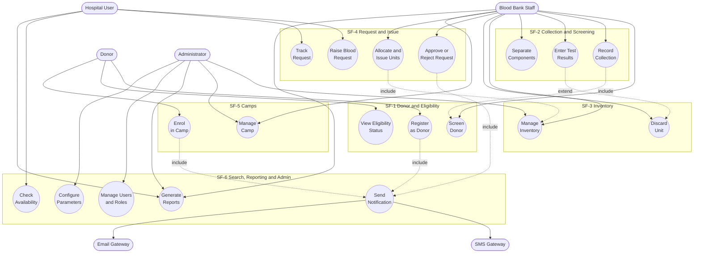
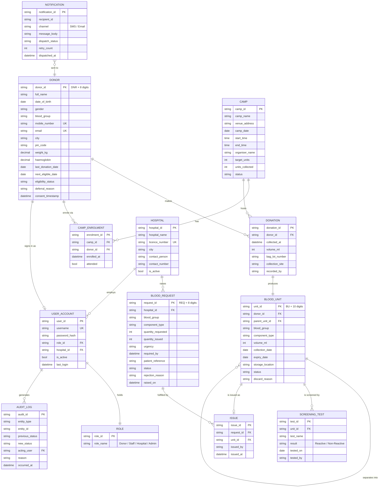
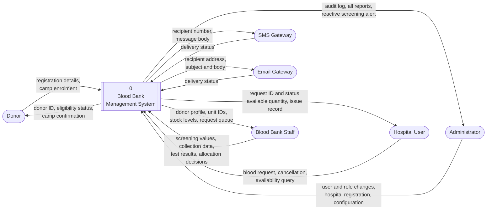
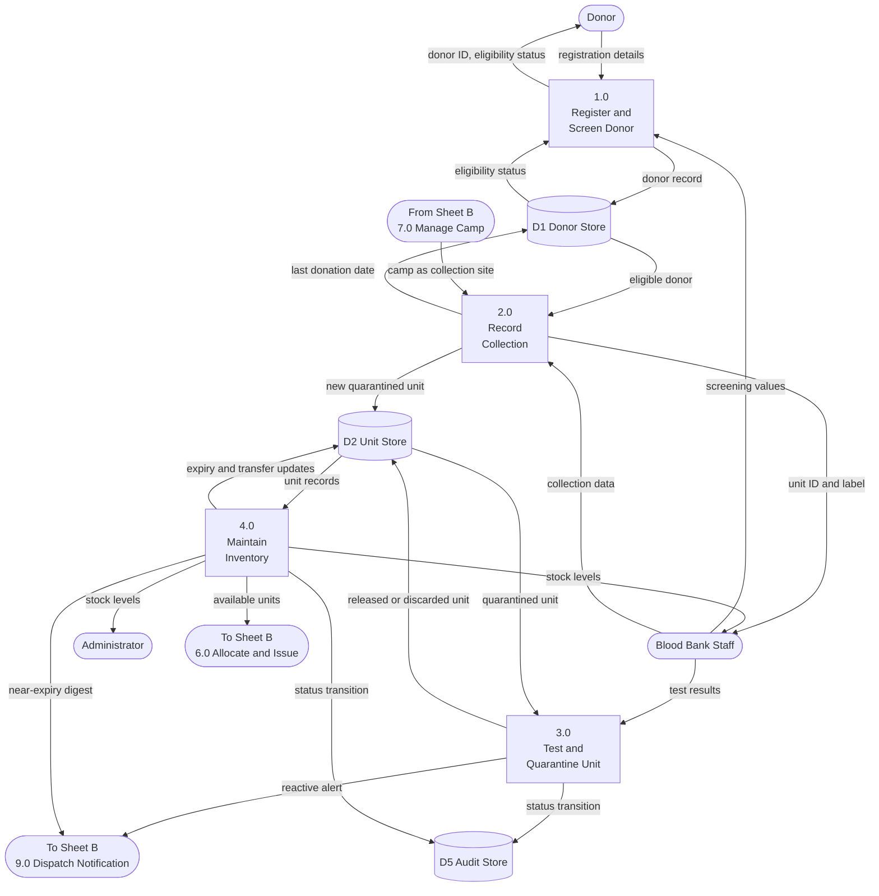
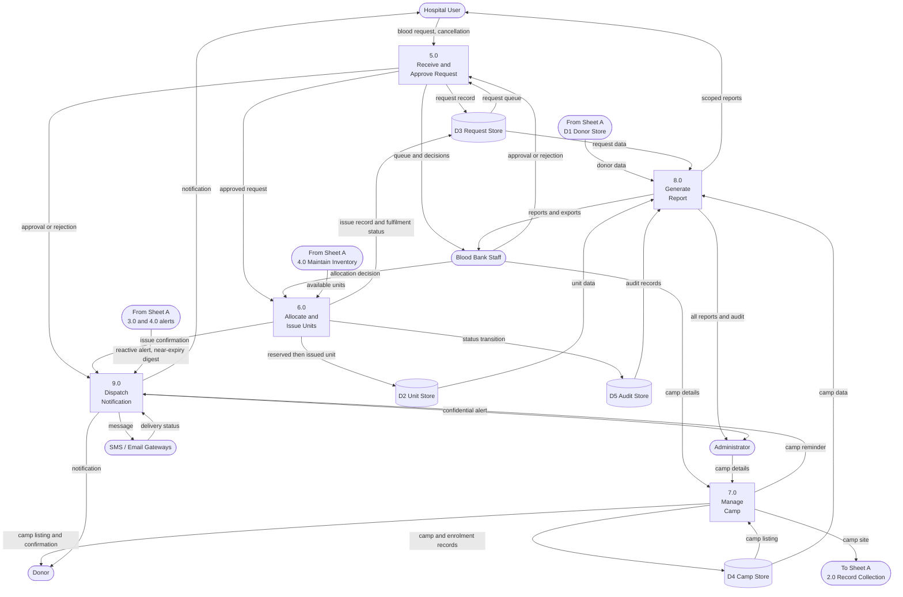
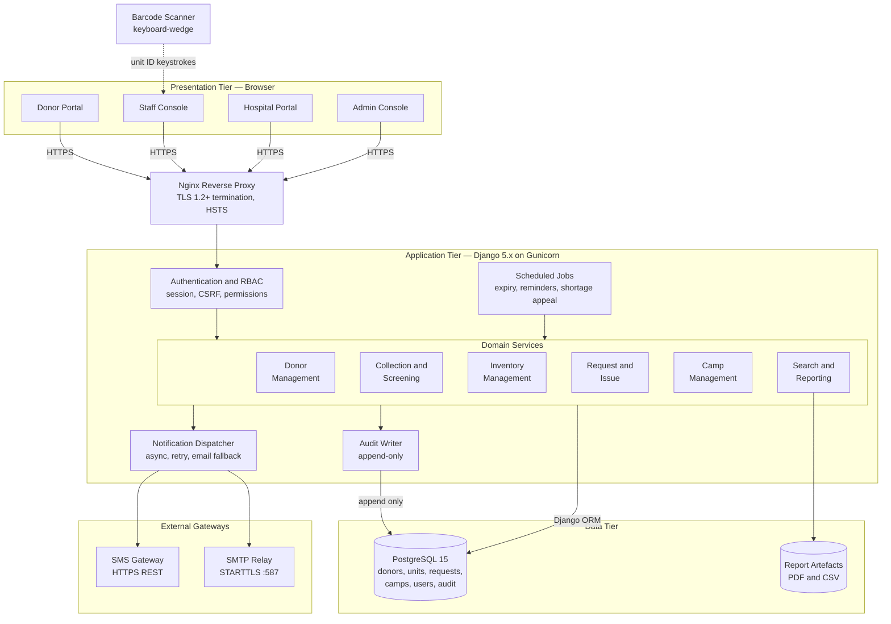

# Analysis Models and Diagrams

Blood Bank Management System, SRS Section 4.

Each diagram is held as a Mermaid source file, which GitHub renders directly, and as an exported PNG for inclusion in the Word submission. Regenerate the images with the command in [../README.md](../README.md).

| Diagram | Source | Image |
|---|---|---|
| Use Case Diagram | [`use-case.mmd`](use-case.mmd) | [`use-case.png`](use-case.png) |
| Entity Relationship Diagram | [`er-diagram.mmd`](er-diagram.mmd) | [`er-diagram.png`](er-diagram.png) |
| Data Flow Diagram, Level 0 | [`dfd-level0.mmd`](dfd-level0.mmd) | [`dfd-level0.png`](dfd-level0.png) |
| Data Flow Diagram, Level 1, Sheet A | [`dfd-level1a-supply.mmd`](dfd-level1a-supply.mmd) | [`dfd-level1a-supply.png`](dfd-level1a-supply.png) |
| Data Flow Diagram, Level 1, Sheet B | [`dfd-level1b-demand.mmd`](dfd-level1b-demand.mmd) | [`dfd-level1b-demand.png`](dfd-level1b-demand.png) |
| System Architecture | [`architecture.mmd`](architecture.mmd) | [`architecture.png`](architecture.png) |

---

## Use Case Diagram

Actors and the use cases each may perform, grouped by system feature. SRS Section 4.

## Entity Relationship Diagram

The fourteen persistent entities, their attributes and their cardinalities. Attribute detail is given in SRS Appendix B.

## Data Flow Diagram, Level 0

The context diagram. The system as a single process with its six external entities.

## Data Flow Diagram, Level 1, Sheet A

Processes 1.0 to 4.0. The path by which blood enters the system, from donor registration through to inventory.

## Data Flow Diagram, Level 1, Sheet B

Processes 5.0 to 9.0. The path by which blood leaves the system, with camp management, reporting and notification.

## System Architecture

Tier decomposition, domain services and external gateways. SRS Section 2.1.

