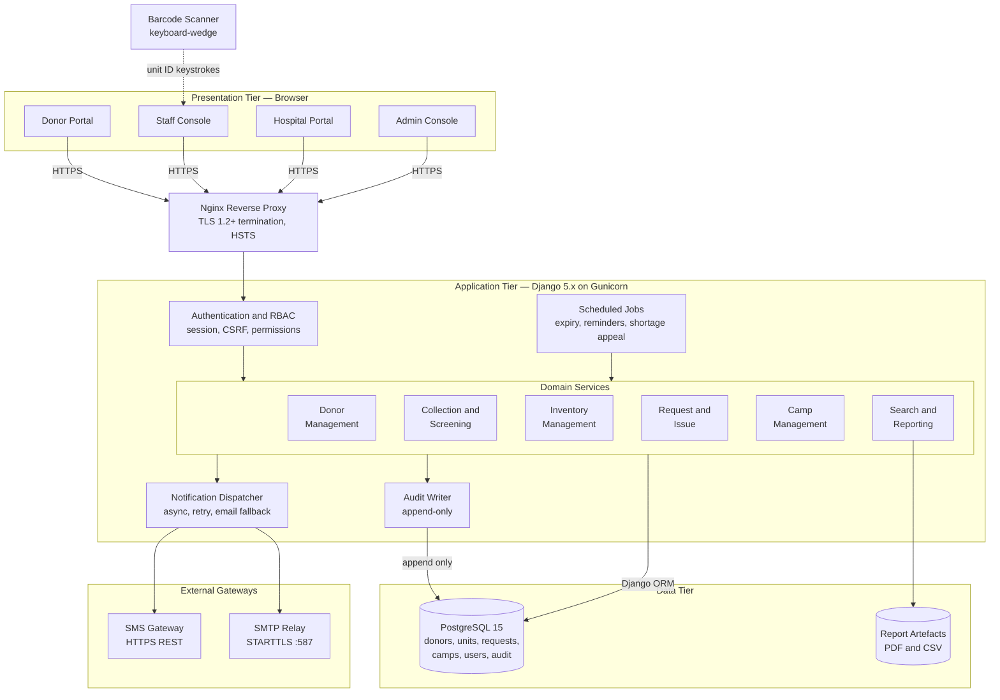
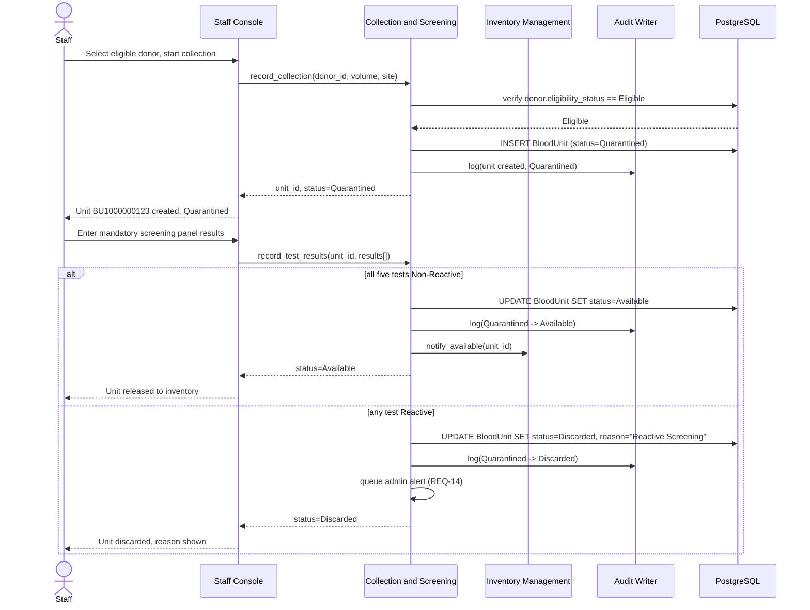
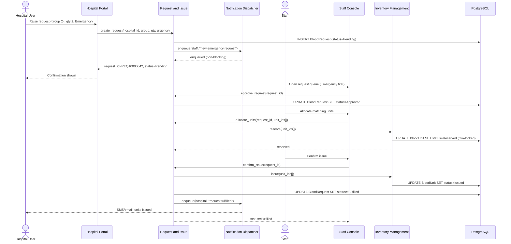

# Software Architecture and Design Specification

## Project: Blood Bank Management System

**Version:** 1.0
**Authors:**

| SRN | Name | GitHub Handle | Role |
|---|---|---|---|
| PES1UG24CS560 | Balaraj R | balaraj74 | Requirements Analyst / Test Lead |
| PES1UG24CS567 | Dhanya K M | Dhanya-KM | System Analyst / Data Modeller |
| PES1UG24CS569 | G A Aadish | Sonuaadi0706 | Project Lead / Architect |
| PES1UG24CS585 | Niveditha | nnivedithaparmesh-cpu | Interface Designer / Documentation Lead |

**Date:** 01 October 2026
**Status:** Draft

---

## Revision History

| Version | Date | Author | Change Summary |
|---|---|---|---|
| 0.1 | 01 Oct 2026 | G A Aadish | Document skeleton, Section 1 Introduction, Section 2 Overview, Section 3 Architecture. |
| 0.2 | 02 Oct 2026 | G A Aadish | Section 4.1 Design Overview, 4.2 UML Sequence Diagrams, 4.3 API Design. |
| 0.3 | 02 Oct 2026 | G A Aadish | Section 4.4 Error Handling, 4.5 UX Design, 4.6 Open Issues, Section 5 Appendices. |
| 1.0 | — | All Members | Consistency pass, approved for submission. |

## Approvals

| Role | Name | Signature/Date |
|---|---|---|
| Project Lead | G A Aadish | |
| Reviewer | Balaraj R | |

---

## 1. Introduction

### 1.1 Purpose

This document specifies the software architecture and detailed design of the Blood Bank Management System (BBMS), Release 1.0. It is the companion to the Software Requirements Specification (`docs/SRS.md`) and the Test Plan (`docs/Test-Plan.md`): the SRS states what the system must do, this document states how it is built to do it, and the Test Plan states how that is verified.

### 1.2 Scope

This document covers the architecture and design of all six system features defined in the SRS: donor registration and eligibility screening, blood collection and screening, inventory management, hospital request and issue, camp management, and search, notification and reporting. It covers the component decomposition, the chosen architectural pattern, the technology stack, the security architecture, two representative interaction flows modelled as UML sequence diagrams, the API design for the request and issue subsystem, and the system's approach to error handling, logging and monitoring.

Detailed low-level design, such as class diagrams or database migration scripts, is implementation artefact and is not part of this document.

### 1.3 Audience

| Reader | Interest |
|---|---|
| Developers | The component boundaries, the API contracts, and the error handling conventions they must implement against. |
| QA Engineers | The architecture that the Test Plan's integration and system test cases exercise. |
| Course Faculty and Evaluators | Whether the design is sound, traceable to the SRS, and addresses security architecturally rather than as an afterthought. |
| Instructors / Reviewers | Confirmation that the IEEE-style architecture and design sections required by the course are present and complete. |

### 1.4 Definitions

See Appendix 5.1 for the full glossary. Terms introduced specifically by this document: **ADR** (Architecture Decision Record), **RBAC** (Role-Based Access Control), **STRIDE** (a threat-modelling mnemonic: Spoofing, Tampering, Repudiation, Information disclosure, Denial of service, Elevation of privilege), **RTM** (Requirement Traceability Matrix, SRS Appendix C).

---

## 2. Document Overview

### 2.1 How to Use This Document

Section 3 describes the architecture: the component decomposition, the pattern chosen and why, the technology stack, architectural risks, traceability from components to requirements, and the security architecture. Section 4 describes the design: two UML sequence diagrams covering representative flows, the API design for the request and issue subsystem, the error handling and monitoring approach, the UX design principles, and open issues deferred to a later release. Section 5 carries the glossary, references and tooling list.

A reader who wants the single-page mental model of the system should read Section 3.3 (the component diagram) and Section 3.5 (the chosen pattern) and stop there. A reader implementing a specific flow should go straight to Section 4.2 and 4.3.

### 2.2 Related Documents

| Document | Location | Relationship |
|---|---|---|
| Software Requirements Specification | `docs/SRS.md` | Defines the 46 functional requirements and the nonfunctional requirements this architecture satisfies. Section 3.8 of this document traces architecture to it directly. |
| Software Test Plan | `docs/Test-Plan.md` | Verifies this architecture and design through test cases traced back to the SRS. |
| Requirement Traceability Matrix | `docs/SRS.md`, Appendix C | The requirement-to-test mapping; this document adds the requirement-to-component mapping in Section 3.8. |

---

## 3. Architecture

### 3.1 Goals and Constraints

**Goals.**

- **Safety first.** No architectural decision may make it possible to issue an untested, expired, or wrong-group blood unit. This is the architecture's highest-priority goal, directly serving NFR-S1 through NFR-S4 in the SRS.
- **Real-time inventory visibility.** A stock change committed by one user must be visible to every other authorised user within 5 seconds (NFR-P5), which rules out any architecture that relies on batch synchronisation between the staff console and the hospital portal.
- **Donor confidentiality by construction.** Donor identity must never reach a hospital-facing code path, not merely be filtered out at the UI layer. This is addressed architecturally in Section 3.9, not left to application-level discipline alone.
- **Deliverable within one semester by a four-person student team.** The architecture must be buildable incrementally, feature by feature, without large upfront infrastructure work.

**Constraints.**

- Python with the Django framework, per SRS constraint CON-1. Node.js with Express was evaluated and rejected because Django's built-in authentication, RBAC scaffolding and ORM materially reduce the work needed to satisfy the security requirements in SRS Section 6.3.
- PostgreSQL 15 in production (SRS OE-3); the Django ORM is the only sanctioned path to the database (CON-2).
- All donor records and unit traceability records are retained for a minimum of five years and are never hard-deleted (CON-6), which constrains the data model to soft-deletion / status transitions rather than row removal.
- No specialised hardware beyond a standard barcode scanner in keyboard-wedge mode (SRS Section 3.4), so the architecture cannot assume a device driver interface.

### 3.2 Stakeholders and Concerns

| Stakeholder | Primary Concern |
|---|---|
| Donor | The system is simple enough to use without training, and their medical and identity data is never exposed to a party outside the blood bank. |
| Blood Bank Staff | The architecture supports high-volume, low-latency entry during collection and screening, and never silently allows an unsafe transition (e.g. issuing an untested unit). |
| Hospital User | Availability data and request status are accurate and current; donor identity is never visible to them, by design, not by policy. |
| Administrator | Full auditability: every status transition and every configuration change is traceable to an acting user. |
| Course Evaluators | The architecture is justified, not just diagrammed, and is traceable to the SRS requirements it exists to satisfy. |

### 3.3 Component (UML) Diagram

The system is a three-tier web application. The diagram below is the system's component diagram: it shows the presentation tier's four role-scoped consoles, the application tier's domain services sitting behind a shared authentication and RBAC layer, the data tier, and the two external gateways. The Mermaid source is at `diagrams/architecture.mmd` and renders directly on GitHub; a PNG export is at `diagrams/architecture.png`.

### 3.4 Component Descriptions

| Component | Responsibility |
|---|---|
| **Donor Portal / Staff Console / Hospital Portal / Admin Console** | Four role-scoped presentation surfaces. Each renders only the screens and controls its role is authorised for (SRS Section 3.1); authorisation is enforced again server-side, never trusted from the client (NFR-SEC5). |
| **Nginx Reverse Proxy** | Terminates TLS 1.2+, enforces HSTS, and is the single network entry point. All plain HTTP is redirected to HTTPS (CI-1). |
| **Authentication and RBAC** | Authenticates every request, issues and validates the session, enforces CSRF tokens on state-changing requests, and resolves the acting user's role before any domain service is invoked. This is the single choke point that NFR-SEC5 and NFR-SEC6 depend on; no domain service re-implements authorisation. |
| **Donor Management** | Registration, eligibility evaluation (REQ-1 to REQ-8), and donor profile access control, including enforcing that a donor can only see their own record. |
| **Collection and Screening** | Records donations, generates unit identifiers, enforces the mandatory screening panel before a unit can leave quarantine, and performs component separation (REQ-9 to REQ-15). This is the only component permitted to create a `BloodUnit` row. |
| **Inventory Management** | Owns unit status transitions, stock aggregation, expiry evaluation, and the discard workflow (REQ-16 to REQ-23). Every transition it performs is written to the Audit Writer in the same database transaction. |
| **Request and Issue** | Owns the hospital request lifecycle and unit allocation (REQ-24 to REQ-31). It is the only component permitted to move a unit from Available to Reserved to Issued, and it enforces the blood-group and expiry checks that back NFR-S2 and NFR-S3. |
| **Camp Management** | Schedules camps, manages donor enrolment with an eligibility check against the camp date, and reconciles camp collections into central inventory (REQ-32 to REQ-37). |
| **Search and Reporting** | Serves the availability search (scoped to counts only for hospital users, REQ-38), generates the six operational reports, and exports them as PDF/CSV (REQ-42 to REQ-44). |
| **Notification Dispatcher** | Sends SMS and email asynchronously, never blocking the transaction that triggered it, with retry and email fallback on SMS failure (REQ-39). |
| **Scheduled Jobs** | Runs the nightly expiry evaluation, eligibility and camp reminders, and the shortage appeal, each invoking the relevant domain service rather than touching the database directly. |
| **Audit Writer** | Appends an immutable record for every status transition and every authentication/authorisation event (NFR-SEC10). No application code path can update or delete an audit row. |
| **PostgreSQL** | The single system of record. Accessed exclusively through the Django ORM (CON-2), with foreign-key constraints enforced at the database level, not only in application code. |

### 3.5 Chosen Architecture Pattern and Rationale

**Pattern chosen: layered monolith, three tiers (presentation, application, data), with the application tier internally decomposed into domain services behind a shared authentication layer.**

This is the same reasoning the SRS records as constraint CON-1, restated here in architectural terms. A microservices decomposition was considered and rejected for this release. The six domain services are not independently scaled, do not have independently varying deployment cadences, and — critically for the safety goal in Section 3.1 — several of the system's hardest correctness requirements (NFR-S1 through NFR-S4) require atomic, single-transaction guarantees across what would otherwise be service boundaries: a unit allocation must atomically check group match, expiry, and availability, and reserve the unit, all inside one database transaction. Splitting Inventory Management and Request and Issue into separate services would turn this into a distributed transaction problem for no benefit at this scale, trading away a safety guarantee for an operational property (independent deployability) the project does not need. A layered monolith backed by a single ACID-compliant database gives the atomicity for free.

Within the application tier, the domain services are still logically separated (as Django apps, one per service in Section 3.4) so that the codebase stays navigable and the team's four members can own a feature each without constant merge conflicts, matching how the SRS's six system features were themselves divided among the team for Deliverable 1.

### 3.6 Technology Stack and Data Stores

| Layer | Technology | Rationale |
|---|---|---|
| Application framework | Python 3.11, Django 5.x | Built-in auth, RBAC, ORM and admin scaffolding, per CON-1. |
| Application server | Gunicorn behind Nginx | Standard, well-understood Django deployment pattern; Nginx also terminates TLS (OE-1, OE-2). |
| Database | PostgreSQL 15 | ACID transactions, required for the atomic allocation guarantee in Section 3.5; SQLite is permitted only for local development and the automated test suite (OE-3). |
| Session store | Server-side, Django's session framework | Keeps session state out of the client, consistent with CI-3's Secure/HttpOnly/SameSite cookie requirement. |
| Notification channels | SMTP over STARTTLS; third-party SMS REST API over HTTPS | Matches SI-3 and SI-4; both are external dependencies the architecture treats as unreliable (Section 3.7). |
| Report artefacts | Server-rendered PDF and RFC 4180 CSV | Matches SI-5 and OR-6/NFR-Q8 interoperability requirement. |

### 3.7 Risks and Mitigations

| Risk | Mitigation |
|---|---|
| SMS gateway outage delays donor and shortage notifications. | Notification Dispatcher retries with backoff, then falls back to email automatically (REQ-39); the triggering transaction is never blocked or rolled back on gateway failure (CI-6). |
| Two staff members attempt to allocate the same unit concurrently. | Allocation is performed inside a single database transaction with a row-level lock on the `BloodUnit` row, so exactly one allocation succeeds and the other is refused (NFR-S4), verified by Test Plan case ST-27. |
| A Django security patch forces an unplanned upgrade mid-semester. | The application depends only on Django's stable public APIs and the ORM; no monkey-patching of framework internals, which keeps upgrades low-risk (DEP-3). |
| Hospital-facing code accidentally exposes a donor field through a new report or API field added later. | Donor confidentiality is enforced at the query layer (Section 3.9), not by a per-view checklist, so a new report built on the same query layer inherits the restriction rather than needing to remember it. |
| Four-person student team, single semester: a team member's section slips and blocks integration. | The six domain services are decomposed so that one member can own and merge a feature independently (Section 3.4), limiting a slip to that feature's screens rather than the whole system, consistent with how the team divided SRS ownership in Deliverable 1. |
| Database becomes the single point of failure for a safety-critical system. | Daily backups with 24-hour RPO and 4-hour RTO (OR-2); PostgreSQL's transactional guarantees are relied on rather than worked around, so a crash mid-transaction cannot leave a unit in an inconsistent status (NFR-Q3). |

### 3.8 Traceability to Requirements

This table maps each architectural component to the SRS functional requirements it exists to satisfy. The finer-grained requirement-to-test mapping is in SRS Appendix C.

| Component | Requirements Satisfied |
|---|---|
| Donor Management | REQ-1 to REQ-8 |
| Collection and Screening | REQ-9 to REQ-15 |
| Inventory Management | REQ-16 to REQ-23 |
| Request and Issue | REQ-24 to REQ-31 |
| Camp Management | REQ-32 to REQ-37 |
| Search and Reporting | REQ-38, REQ-42 to REQ-44 |
| Notification Dispatcher | REQ-39 to REQ-41 |
| Authentication and RBAC | REQ-44, REQ-45, and the NFR-SEC series |
| Audit Writer | REQ-23, NFR-SEC10 |
| Scheduled Jobs | REQ-19, REQ-20, REQ-40, REQ-41 |

### 3.9 Security Architecture

**Threat model (STRIDE).** Each category is mapped to the architectural control that addresses it, not merely to a policy statement.

| Threat | Example in BBMS | Architectural Control |
|---|---|---|
| **S**poofing | An unauthenticated request claims to be staff to record a collection. | Authentication and RBAC is the single entry point for every domain service; no domain service accepts a request that has not passed through it (Section 3.4). |
| **T**ampering | A hospital user edits the quantity field of a unit allocation request after it was reserved. | All state-changing writes go through the Django ORM inside a transaction; the allocation state machine (Section 3.5) only accepts transitions from a fixed set of prior states, rejecting an out-of-sequence request. |
| **R**epudiation | Staff deny having discarded a specific unit. | The Audit Writer appends an immutable record of every status transition with the acting user and timestamp (NFR-SEC10); no code path can update or delete it. |
| **I**nformation disclosure | A hospital-facing report or API accidentally returns a donor's name. | Donor identity is excluded at the query layer that serves hospital-facing endpoints, so it is architecturally absent from the response, not filtered out after the fact (BR-9, NFR-SEC7). |
| **D**enial of service | A flood of registration requests exhausts database connections. | Nginx rate-limits at the edge; Gunicorn runs a bounded worker pool; the notification dispatch path is asynchronous so a gateway outage cannot back up request-handling threads (CI-6). |
| **E**levation of privilege | A donor account attempts to reach a staff-only or admin-only URL directly. | Authorisation is checked server-side on every request against the role resolved by the Authentication and RBAC layer, independent of what the client's UI exposes (NFR-SEC5), verified by Test Plan case ST-28. |

**Defence in depth beyond STRIDE.** Passwords are stored as salted hashes from a deliberately slow key derivation function, never reversibly encrypted (NFR-SEC2). All traffic is TLS 1.2+ (NFR-SEC8). Parameter binding is used for all database access and all user-supplied content is contextually escaped on output, addressing the OWASP Top Ten injection and XSS classes (NFR-SEC9). Sessions expire after 30 minutes of inactivity and are invalidated on logout and password change (NFR-SEC11).

---

## 4. Design

### 4.1 Design Overview

The design follows directly from the layered architecture in Section 3. Each domain service exposes its behaviour through a small set of service-layer functions (not through the ORM models directly), so that the view layer, the scheduled jobs, and the future API consumers all go through the same validated entry point. Section 4.2 traces two representative flows through these service boundaries; Section 4.3 specifies the API contract for the two most externally-facing components, Request and Issue and Search; Section 4.4 specifies how failures are surfaced and observed; Section 4.5 states the UX principles that apply across all four consoles; Section 4.6 lists what is deliberately deferred.

### 4.2 UML Sequence Diagrams

Two flows are modelled: the supply-side flow from collection to available inventory, and the demand-side flow from a hospital request to an issued unit. Together they exercise every tier in the architecture diagram and both external gateways. Sources are `diagrams/sequence-collection-release.mmd` and `diagrams/sequence-request-issue.mmd`, with PNG exports alongside for the Word submission.

#### 4.2.1 Sequence: Record Collection, Screen, and Release to Inventory

Covers REQ-9 through REQ-14 (SRS Section 5.2) and the Quarantine → Available transition rule (NFR-S1).

#### 4.2.2 Sequence: Hospital Raises an Emergency Request and Receives Issued Units

Covers REQ-24 through REQ-29 (SRS Section 5.4) and the asynchronous notification guarantee (CI-6, REQ-39).

### 4.3 API Design

Interface definitions for the two most externally-facing components: Request and Issue, and Search. These are the internal service APIs the view layer and, in a future release, an external API client would call; they are not yet exposed as a public API in Release 1.0.

**Component: Request and Issue**

| Endpoint | Method | Request | Response | Errors |
|---|---|---|---|---|
| `/api/requests` | POST | `{hospital_id, blood_group, component_type, quantity, urgency, required_by, patient_reference}` | `201 {request_id, status: "Pending"}` | `400` invalid quantity or past required-by date (REQ-25) |
| `/api/requests/{id}/approve` | POST | `{}` | `200 {status: "Approved"}` | `403` not staff role; `409` request not Pending |
| `/api/requests/{id}/reject` | POST | `{reason}` | `200 {status: "Rejected", reason}` | `400` missing reason |
| `/api/requests/{id}/allocate` | POST | `{unit_ids: []}` | `200 {status: "Reserved", unit_ids}` | `409` unit not Available, group mismatch, or expired (NFR-S2, NFR-S3) |
| `/api/requests/{id}/issue` | POST | `{}` | `200 {status: "Fulfilled" \| "Partially Fulfilled", issued_qty, shortfall}` | `409` no units reserved |
| `/api/requests/{id}` | GET | — | `200 {request_id, status, blood_group, quantity, issued_qty, ...}` | `403` hospital user requesting another hospital's record (NFR-SEC6) |

**Component: Search**

| Endpoint | Method | Request | Response | Errors |
|---|---|---|---|---|
| `/api/availability` | GET | `?blood_group=O-&component=PRBC` | `200 {blood_group, component, available_count}` | `400` invalid group/component value |

The availability response for a caller in the Hospital User role never includes a `unit_id` or any donor field, by construction of the query the endpoint runs (Section 3.9); the same endpoint called by Staff may additionally return unit-level detail, gated by role inside the same handler rather than by a separate endpoint, which keeps the "never leaks to hospital" guarantee in one place.

*Content pending — 4.4 Error Handling/Logging/Monitoring, 4.5 UX Design, 4.6 Open Issues.*

---

## 5. Appendices

*Content pending.*

---

**End of Software Architecture and Design Specification, Version 1.0**
