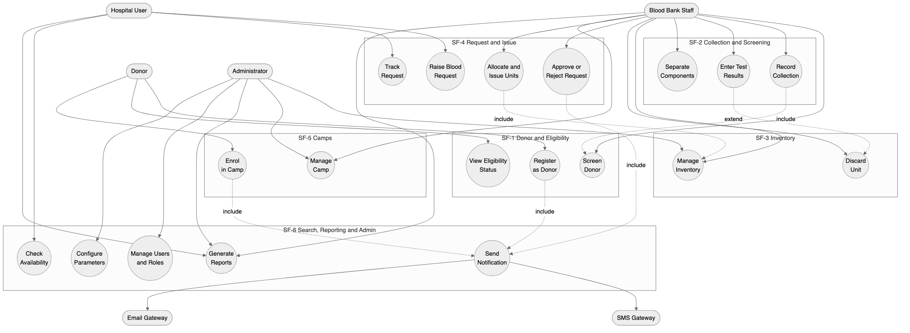

# Software Requirements Specification

## for Blood Bank Management System

**Version 1.0 approved**

**Prepared by**

| SRN | Name | GitHub Handle | Role |
|---|---|---|---|
| PES1UG24CS560 | Balaraj R | balaraj74 | Requirements Analyst / Test Lead |
| PES1UG24CS567 | Dhanya K M | Dhanya-KM | System Analyst / Data Modeller |
| PES1UG24CS569 | G A Aadish | Sonuaadi0706 | Project Lead / Architect |
| PES1UG24CS585 | Niveditha | nnivedithaparmesh-cpu | Interface Designer / Documentation Lead |

**Organization:** SE-miniproject1
**Course:** Software Engineering — Mini Project
**Date Created:** 08 September 2026
**Date Approved:** 10 September 2026

---

## Table of Contents

- [Revision History](#revision-history)
- [1. Introduction](#1-introduction)
  - [1.1 Purpose](#11-purpose)
  - [1.2 Intended Audience and Reading Suggestions](#12-intended-audience-and-reading-suggestions)
  - [1.3 Product Scope](#13-product-scope)
  - [1.4 References](#14-references)
- [2. Overall Description](#2-overall-description)
  - [2.1 Product Perspective](#21-product-perspective)
  - [2.2 Product Functions](#22-product-functions)
  - [2.3 User Classes and Characteristics](#23-user-classes-and-characteristics)
  - [2.4 Operating Environment](#24-operating-environment)
  - [2.5 Design and Implementation Constraints](#25-design-and-implementation-constraints)
  - [2.6 Assumptions and Dependencies](#26-assumptions-and-dependencies)
- [3. External Interface Requirements](#3-external-interface-requirements)
  - [3.1 User Interfaces](#31-user-interfaces)
  - [3.2 Software Interfaces](#32-software-interfaces)
  - [3.3 Communications Interfaces](#33-communications-interfaces)
  - [3.4 Hardware Interfaces](#34-hardware-interfaces)
- [4. Analysis Models](#4-analysis-models)
- [5. System Features](#5-system-features)
  - [5.1 Donor Registration and Eligibility Screening](#51-donor-registration-and-eligibility-screening)
  - [5.2 Blood Donation and Collection Management](#52-blood-donation-and-collection-management)
  - [5.3 Blood Inventory and Stock Management](#53-blood-inventory-and-stock-management)
  - [5.4 Hospital Blood Request and Issue](#54-hospital-blood-request-and-issue)
  - [5.5 Donation Camp and Drive Management](#55-donation-camp-and-drive-management)
  - [5.6 Search, Notification and Reporting](#56-search-notification-and-reporting)
- [6. Other Nonfunctional Requirements](#6-other-nonfunctional-requirements)
  - [6.1 Performance Requirements](#61-performance-requirements)
  - [6.2 Safety Requirements](#62-safety-requirements)
  - [6.3 Security Requirements](#63-security-requirements)
  - [6.4 Software Quality Attributes](#64-software-quality-attributes)
  - [6.5 Business Rules and Domain Requirements](#65-business-rules-and-domain-requirements)
- [7. Other Requirements](#7-other-requirements)
- [Appendix A: Glossary](#appendix-a-glossary)
- [Appendix B: Field Layouts](#appendix-b-field-layouts)
- [Appendix C: Requirement Traceability Matrix](#appendix-c-requirement-traceability-matrix)

---

## Revision History

| Name | Date | Reason For Changes | Version |
|---|---|---|---|
| G A Aadish | 09 Sep 2026 | Initial document skeleton, Section 1 Introduction and Section 2 Overall Description drafted. | 0.1 |
| G A Aadish | 09 Sep 2026 | Section 5 System Features SF-4 to SF-6 with functional requirements REQ-24 to REQ-46. | 0.2 |
| Niveditha | 11 Sep 2026 | Section 6 Nonfunctional Requirements and Section 7 Other Requirements. | 0.3 |
| Dhanya K M | 11 Sep 2026 | Section 4 Analysis Models added: use case, ER, DFD Level 0 and DFD Level 1 Sheets A and B. | 0.4 |
| Dhanya K M | 11 Sep 2026 | Appendix A Glossary and Appendix B Field Layouts. | 0.5 |
| Niveditha | 29 Sep 2026 | Section 3 External Interface Requirements added; screen inventory, error message and confirmation standards defined. | 0.6 |
| Balaraj R | 02 Oct 2026 | Section 5 System Features SF-1 to SF-3 with functional requirements REQ-1 to REQ-23. | 0.7 |
| Balaraj R | 02 Oct 2026 | Appendix C Requirement Traceability Matrix populated against test case IDs. | 0.8 |
| Balaraj R | 02 Oct 2026 | Appendix C reconciled against the completed Test Plan; requirement numbering audited. | 0.9 |
| All Members | 02 Oct 2026 | Peer review, consistency and proofreading pass. Approved as Version 1.0 for submission. | 1.0 |

---

## 1. Introduction

### 1.1 Purpose

This Software Requirements Specification describes the software requirements for the **Blood Bank Management System (BBMS), Release 1.0**. The BBMS is a web-based application that manages the full life cycle of donated blood, from the registration and eligibility screening of a donor, through collection, testing, component separation and storage, to the fulfilment of blood requests raised by hospitals.

This document covers the complete system as scoped for Release 1.0. It specifies the behaviour of all six functional subsystems, the external interfaces exposed to users and to other software, and the nonfunctional characteristics the system must exhibit. No part of the system is deferred to a separate SRS.

The document does not describe the internal design, database schema implementation, or user interface visual styling. Those are addressed in the Design Document and are outside the scope of this specification.

### 1.2 Intended Audience and Reading Suggestions

This SRS is written for the following readers.

| Reader | Interest | Suggested Reading Order |
|---|---|---|
| Course Faculty and Evaluators | Completeness, consistency and verifiability of the requirements | Section 1, Section 2, Section 5, Appendix C |
| Development Team | What to build and against what constraints | Section 2.4 to 2.6, Section 3, Section 4, Section 5 |
| Test Team | What to verify and how success is judged | Section 5, Section 6, Appendix C, and the companion Test Plan |
| Blood Bank Staff and Domain Reviewers | Whether the described behaviour matches real blood bank practice | Section 1.3, Section 2.2, Section 2.3, Section 6.5 |
| Hospital Users | How requests are raised and fulfilled | Section 5.4, Section 5.6, Section 3.1 |

The remainder of this SRS is organised as follows. Section 2 gives the overall product context, its major functions and its users. Section 3 defines the interfaces to users, to other software and over the network. Section 4 presents the analysis models. Section 5 carries the detailed functional requirements grouped by system feature, each requirement uniquely tagged. Section 6 states the nonfunctional requirements. Section 7 covers remaining requirements. The appendices provide a glossary, field layouts and the requirement traceability matrix.

Readers new to the project should read Section 1 and Section 2 first, then move to Section 5 for detail.

### 1.3 Product Scope

The Blood Bank Management System replaces the paper registers and disconnected spreadsheets that a mid-sized blood bank currently uses to track donors, stock and hospital demand. Its purpose is to make the location, quantity and expiry status of every blood unit visible in real time, and to make the matching of a hospital request against available stock a controlled, auditable operation rather than a phone call.

The benefits and objectives of the product are as follows.

- **Reduce wastage from expiry.** Blood components have short shelf lives. By tracking expiry per unit and surfacing units nearing expiry, the system aims to cut expiry-driven wastage.
- **Reduce time to fulfil an emergency request.** A hospital raising an urgent request should see candidate units immediately rather than waiting on manual stock checks.
- **Enforce donor safety rules automatically.** The mandatory interval between donations, minimum age, minimum weight and haemoglobin thresholds are checked by the system rather than remembered by staff.
- **Provide an audit trail.** Every unit can be traced from the donor who gave it to the hospital that received it, which is a regulatory expectation in blood banking.
- **Improve donor retention.** Donors are notified when they become eligible again and when their blood group is in short supply.

The following are explicitly **out of scope** for Release 1.0: laboratory instrument integration, financial billing and payment processing, integration with national blood registries, and a native mobile application. These may be considered in later releases.

### 1.4 References

1. IEEE Std 830-1998, *IEEE Recommended Practice for Software Requirements Specifications*, Institute of Electrical and Electronics Engineers, 1998.
2. *SRS-Template.docx*, Software Engineering course template, PES University, 2026. Supplied with the course material and used as the structural basis of this document.
3. *Test-Plan-Details.docx*, Software Engineering course template, PES University, 2026. Defines the test case template referenced in Appendix C.
4. National Blood Transfusion Council, *Standards for Blood Banks and Blood Transfusion Services*, Ministry of Health and Family Welfare, Government of India. Source of the donor eligibility and component shelf-life rules stated in Section 6.5.
5. Django Software Foundation, *Django Documentation, Version 5.x*. Available at https://docs.djangoproject.com/
6. OWASP Foundation, *OWASP Application Security Verification Standard, Version 4.0*. Basis of the security requirements in Section 6.3.
7. Project repository: https://github.com/SE-miniproject1/mini-project-documents

---

## 2. Overall Description

### 2.1 Product Perspective

The Blood Bank Management System is a **new, self-contained product**. It is not a member of an existing product family and it does not replace a specific existing software system. It replaces a manual, register-based process.

The system is a three-tier web application. A browser-based presentation tier serves four distinct user classes. An application tier holds the business logic, including the eligibility rules, the inventory allocation logic and the request approval workflow. A data tier holds the persistent records for donors, units, requests, camps and users.

The system has three external touch points. It sends outbound email and SMS through third-party gateways. It accepts no inbound automated traffic in Release 1.0. It exports reports as PDF and CSV files for offline use.

```
                 +-------------------------------------------+
                 |            Presentation Tier              |
                 |   Donor Portal | Staff Console |          |
                 |   Hospital Portal | Admin Console         |
                 +---------------------+---------------------+
                                       | HTTPS
                 +---------------------v---------------------+
                 |            Application Tier               |
                 |  Donor Mgmt | Collection | Inventory |    |
                 |  Request Mgmt | Camp Mgmt | Reporting     |
                 |  Auth & RBAC  | Notification Dispatcher   |
                 +------+--------------------+---------------+
                        |                    |
             +----------v--------+   +-------v-----------------+
             |    Data Tier      |   |  External Gateways      |
             |  Relational DB    |   |  Email SMTP | SMS API   |
             +-------------------+   +-------------------------+
```

A rendered version of this diagram is provided in `diagrams/architecture.mmd`, with an exported image at `diagrams/architecture.png`.

### 2.2 Product Functions

The major functions the product must perform are summarised below. Each maps to a system feature detailed in Section 5.

- **Donor management.** Register a donor, capture medical and contact details, screen the donor against eligibility rules, and maintain donation history.
- **Collection management.** Record a donation event, generate a uniquely identified blood unit, record screening test outcomes, and separate whole blood into components.
- **Inventory management.** Track every unit by blood group, component type, storage location, status and expiry date. Flag units nearing expiry and quarantine units that fail screening.
- **Request management.** Allow a registered hospital to raise a blood request, allow staff to approve, reject or partially fulfil it, and record the issue of specific units against it.
- **Camp management.** Schedule donation camps, register donors for a camp, and reconcile collections made at a camp back into central inventory.
- **Search, notification and reporting.** Search availability by group, component and location. Notify donors and hospitals of relevant events. Generate operational and statutory reports.

### 2.3 User Classes and Characteristics

Four user classes are anticipated.

**UC-1 Donor.** A member of the public who registers to donate blood. Low technical expertise is assumed. Uses the system infrequently, perhaps three or four times a year. Accesses only their own profile, donation history, camp listings and eligibility status. This is the largest class by headcount and an important class to satisfy, because a poor donor experience directly reduces the blood supply. Interfaces for this class must be usable on a mobile browser without training.

**UC-2 Blood Bank Staff.** Technicians and counsellors employed by the blood bank. Moderate technical expertise. Uses the system continuously through the working day and is the heaviest user by transaction volume. Performs screening, records collections, manages inventory and processes hospital requests. This is the **most important user class**, because the correctness and speed of their workflows determines whether the system delivers its objectives. Requires dense, keyboard-efficient screens rather than simplified ones.

**UC-3 Hospital User.** An authorised representative of a registered hospital, typically a blood bank liaison or a duty doctor. Moderate technical expertise, often working under time pressure in emergencies. Raises requests, tracks their status and views issue history for their own hospital only. Cannot see donor identities.

**UC-4 Administrator.** A blood bank manager or system administrator. High technical expertise. Uses the system daily but for a small set of functions. Manages user accounts and roles, registers hospitals, configures eligibility and expiry parameters, and views all reports and audit logs. Smallest class by headcount, highest privilege level.

Requirements REQ-40 through REQ-46 in Section 5.6 pertain principally to UC-4. Requirements REQ-24 through REQ-31 pertain principally to UC-3.

### 2.4 Operating Environment

**OE-1 Server environment.** The application runs on a 64-bit Linux server, Ubuntu 22.04 LTS or later.

**OE-2 Application platform.** Python 3.11 or later with the Django 5.x web framework, served by Gunicorn behind an Nginx reverse proxy.

**OE-3 Database.** PostgreSQL 15 or later. SQLite 3 is permitted for local development and for the automated test suite only.

**OE-4 Client environment.** The system must operate correctly on the current and immediately preceding major versions of Google Chrome, Mozilla Firefox, Microsoft Edge and Apple Safari, on Windows 10 or later, macOS 13 or later, Android 10 or later and iOS 15 or later.

**OE-5 Screen sizes.** The interface must render usably from a 360-pixel-wide mobile viewport up to a 1920-pixel-wide desktop viewport.

**OE-6 Coexistence.** The system must coexist with the blood bank's existing office productivity software and must not require any client-side installation beyond a standards-compliant browser.

### 2.5 Design and Implementation Constraints

**CON-1 Technology stack.** The implementation shall use Python with the Django framework and the Django ORM. Node.js with Express was evaluated as an alternative and rejected for Release 1.0, because Django's built-in authentication, role and administrative scaffolding materially reduce the work needed for the access-control requirements in Section 6.3. Any move to Node.js would require a re-baseline of this SRS.

**CON-2 Database access.** All persistent access shall go through the Django ORM. Raw SQL is permitted only where a query cannot be expressed through the ORM, and every such instance must use parameter binding.

**CON-3 Coding standards.** Python code shall conform to PEP 8. JavaScript, where used for client-side interactivity, shall conform to the Airbnb style guide. All code shall pass the project linters before merge.

**CON-4 Version control.** All work products, including this document, shall be maintained in the Git repository named in Section 1.4. Direct commits to the default branch are prohibited; changes shall be merged through pull requests with at least one peer review.

**CON-5 Regulatory constraint.** Donor identity shall never be disclosed to hospital users. This is a privacy requirement of blood banking practice and constrains the design of the request and issue screens.

**CON-6 Data retention.** Donor records and unit traceability records shall be retained for a minimum of five years and shall not be hard-deleted by any application function.

**CON-7 Time and team constraint.** The project is delivered by a four-member student team within a single academic semester. This constrains Release 1.0 to the scope stated in Section 1.3 and rules out the out-of-scope items listed there.

**CON-8 Offline operation.** The system is not required to operate without network connectivity. No offline mode shall be assumed by any requirement.

### 2.6 Assumptions and Dependencies

**ASM-1** It is assumed that the blood bank has reliable broadband connectivity during working hours. The performance requirements in Section 6.1 are stated on that assumption.

**ASM-2** It is assumed that screening test results are entered manually by a technician. No laboratory instrument produces machine-readable output for this release. If instrument integration becomes available, REQ-12 and REQ-13 will need revision.

**ASM-3** It is assumed that each hospital nominates and vouches for its own authorised users. The system does not independently verify that a hospital user is a licensed medical practitioner.

**ASM-4** It is assumed that donors provide accurate self-reported medical history. The system records declarations but cannot validate them.

**ASM-5** It is assumed that the component shelf-life values in Section 6.5 remain as stated. These are configurable, so a change in regulation is absorbed by configuration and not by code change.

**DEP-1** The system depends on a third-party SMS gateway for donor notifications. If the gateway is unavailable, notification requirements degrade to email only, as stated in REQ-39.

**DEP-2** The system depends on an SMTP relay for email notification and for password reset.

**DEP-3** The system depends on the Django framework and its security patch stream. A critical framework vulnerability may force an unplanned upgrade.

**DEP-4** The system reuses no components from other projects. All application code is written for this project.

---

## 3. External Interface Requirements

### 3.1 User Interfaces

The system presents four role-scoped web interfaces. All are served as responsive HTML rendered by the server, progressively enhanced with client-side scripting.

**UI-1 General characteristics.** All screens share a common layout comprising a header carrying the system name and the signed-in user's name and role, a left navigation panel scoped to the user's role, a main content region, and a footer. On viewports narrower than 768 pixels the navigation panel collapses into a menu control.

**UI-2 Standard controls.** Every screen shall carry a Help control in the header opening context-sensitive guidance. Every data entry form shall carry Save and Cancel controls, with Cancel returning to the previous screen without persisting changes. Every list screen shall support column sorting and pagination at 25 rows per page.

**UI-3 Keyboard shortcuts.** For the staff console, the following shortcuts shall be provided, because staff perform high-volume repetitive entry: Alt+N new record, Alt+S save, Alt+F focus search, Escape cancel current dialog.

**UI-4 Error message standard.** Errors shall be displayed adjacent to the field in error, in red, prefixed with the field label, and shall state the corrective action. A summary banner shall appear at the top of the form listing all errors. Error text shall never expose stack traces, SQL, or internal identifiers.

**UI-5 Confirmation standard.** Any irreversible operation, including issuing a unit, discarding a unit and deactivating a user, shall require an explicit confirmation dialog naming the specific record affected.

**UI-6 Screen inventory.** The following screens shall be provided.

| Screen | User Class | Purpose |
|---|---|---|
| Login and Password Reset | All | Authentication |
| Donor Registration | UC-1 | Self-registration |
| Donor Dashboard | UC-1 | Eligibility status, next eligible date, history |
| Camp Listing and Enrolment | UC-1 | Browse and enrol in camps |
| Donor Search and Screening | UC-2 | Locate donor, record screening |
| Collection Entry | UC-2 | Record a donation, generate unit |
| Test Result Entry | UC-2 | Record screening test outcomes |
| Inventory Console | UC-2, UC-4 | Stock by group, component, status, expiry |
| Request Queue | UC-2 | Review and act on hospital requests |
| Issue and Cross-match | UC-2 | Allocate specific units to a request |
| Hospital Request Form | UC-3 | Raise a request |
| Hospital Request Tracker | UC-3 | Status and issue history |
| Camp Management | UC-2, UC-4 | Create and manage camps |
| User and Role Administration | UC-4 | Accounts, roles, hospital registration |
| Configuration | UC-4 | Eligibility and expiry parameters |
| Reports | UC-2, UC-3, UC-4 | Generate and export reports |

**UI-7 Accessibility.** Screens shall meet WCAG 2.1 Level AA for colour contrast, keyboard operability and form labelling.

Detailed visual design is documented separately in the user interface specification and is not part of this SRS.

### 3.2 Software Interfaces

**SI-1 Database.** PostgreSQL 15 or later, accessed through the Django ORM over the psycopg driver. Data items exchanged are the persistent entities described in Appendix B. The interface is a local or private-network TCP connection using connection pooling. Credentials are supplied through environment variables and never committed to source control.

**SI-2 Web framework.** Django 5.x. The system uses its authentication, session, ORM, form validation, template and administrative subsystems. Incoming data items are HTTP request objects; outgoing data items are rendered HTML responses, JSON responses and file downloads.

**SI-3 Email gateway.** An SMTP relay reached over TLS on port 587. Outgoing data items are notification messages carrying recipient address, subject and body. No inbound mail is processed. The service required is reliable one-way delivery. Delivery failures are logged and retried as specified in REQ-39.

**SI-4 SMS gateway.** A third-party HTTP API. Outgoing data items are a recipient mobile number and a message body of at most 160 characters. The API is invoked over HTTPS with a bearer token held in configuration. Responses carry a delivery status which is persisted against the notification record.

**SI-5 PDF and spreadsheet generation.** A server-side reporting library generates PDF and CSV artefacts. Incoming data items are report parameter sets; outgoing data items are binary files streamed to the browser.

**SI-6 Shared data.** The donor identifier, unit identifier and request identifier are the data items shared across the donor management, inventory and request management components. These identifiers are generated centrally as specified in REQ-2, REQ-10 and REQ-24 and are treated as immutable once assigned. No global shared memory area is used; all sharing is through the database.

### 3.3 Communications Interfaces

**CI-1 Protocol.** All client-server communication shall use HTTP over TLS 1.2 or higher. Plain HTTP requests shall be redirected to HTTPS. HTTP Strict Transport Security shall be enabled.

**CI-2 Message format.** Form submissions use `application/x-www-form-urlencoded` or `multipart/form-data`. Asynchronous calls exchange `application/json` encoded as UTF-8. Report downloads use `application/pdf` or `text/csv`.

**CI-3 Session management.** Sessions are maintained by a server-side session store keyed by a cookie marked Secure, HttpOnly and SameSite=Lax.

**CI-4 Electronic mail.** Notification email is sent over SMTP with STARTTLS. Messages are sent as multipart alternative carrying both plain text and HTML parts.

**CI-5 Data transfer rate.** No single page response shall require more than 1 MB of transfer excluding cached static assets, so that the system remains usable on a 2 Mbps connection.

**CI-6 Synchronisation.** Notification dispatch is asynchronous and shall not block the user transaction that triggered it. A failed dispatch shall not roll back the originating transaction.

**CI-7 Security of communication.** No personally identifiable donor data shall be placed in a URL query string. All such data shall be transmitted in the request body.

### 3.4 Hardware Interfaces

**HI-1 Barcode scanner.** The system shall accept blood unit identifiers from a USB or Bluetooth barcode scanner operating in keyboard-wedge mode. No device driver interface is required, because the scanner presents itself as a keyboard and the unit identifier field simply receives the scanned characters followed by a carriage return.

**HI-2 Label printer.** Unit labels shall be produced as a printable document rendered by the browser's print pipeline. No direct printer interface is required.

**HI-3 Server hardware.** Minimum server specification is 4 virtual CPUs, 8 GB RAM and 100 GB storage. No specialised hardware is required.

---

## 4. Analysis Models

The analysis models for the system are maintained as diagram sources in the `diagrams/` directory of the project repository. The use case diagram is shown in full below because it is the primary analysis model; the remaining models are referenced by file.

### 4.1 Use Case Diagram



*Figure: UML use case diagram. Actors are the Donor, Blood Bank Staff, Hospital User and Administrator, with the SMS and Email gateways as external system actors. Source: `diagrams/use-case.mmd`.*

### 4.2 Use Case Summary

| ID | Use Case | Primary Actor | Requirements |
|---|---|---|---|
| UC1 | Register as Donor | Donor | REQ-1 to REQ-5 |
| UC2 | View Eligibility Status | Donor | REQ-6, REQ-8 |
| UC3 | Enrol in Camp | Donor | REQ-34, REQ-35 |
| UC4 | Screen Donor | Blood Bank Staff | REQ-6, REQ-7 |
| UC5 | Record Collection | Blood Bank Staff | REQ-9 to REQ-11 |
| UC6 | Enter Test Results | Blood Bank Staff | REQ-12 to REQ-14 |
| UC7 | Separate Components | Blood Bank Staff | REQ-15 |
| UC8 | Manage Inventory | Blood Bank Staff, Administrator | REQ-16 to REQ-21 |
| UC9 | Discard Unit | Blood Bank Staff | REQ-22, REQ-23 |
| UC10 | Raise Blood Request | Hospital User | REQ-24, REQ-25 |
| UC11 | Track or Cancel Request | Hospital User | REQ-30, REQ-31, REQ-44 |
| UC12 | Check Availability | Hospital User | REQ-38 |
| UC13 | Approve or Reject Request | Blood Bank Staff | REQ-26, REQ-27 |
| UC14 | Allocate and Issue Units | Blood Bank Staff | REQ-28 to REQ-30 |
| UC15 | Manage Camp | Blood Bank Staff, Administrator | REQ-32, REQ-33, REQ-36, REQ-37 |
| UC16 | Generate Reports | Staff, Hospital User, Administrator | REQ-42 to REQ-44 |
| UC17 | Manage Users and Roles | Administrator | REQ-45 |
| UC18 | Configure Parameters | Administrator | REQ-46 |
| UC19 | Send Notification | System (SMS and Email gateways) | REQ-39 to REQ-41 |

### 4.3 Other Models

| Model | Source File | Purpose |
|---|---|---|
| Entity Relationship Diagram | `diagrams/er-diagram.mmd` | Persistent entities, attributes and cardinalities |
| Data Flow Diagram, Level 0 | `diagrams/dfd-level0.mmd` | System context and external entities |
| Data Flow Diagram, Level 1 Sheet A | `diagrams/dfd-level1a-supply.mmd` | Processes 1.0 to 4.0, the supply side |
| Data Flow Diagram, Level 1 Sheet B | `diagrams/dfd-level1b-demand.mmd` | Processes 5.0 to 9.0, demand, camps and reporting |
| Architecture Diagram | `diagrams/architecture.mmd` | Tier decomposition and external gateways |

## 5. System Features

The functional requirements are organised by system feature, which are the major services the product provides. Six features are specified. Each requirement carries a unique tag of the form `REQ-n` and is traced in Appendix C.

Priority is stated as High, Medium or Low, supported by component ratings for benefit, penalty, cost and risk, each on a scale of 1 to 9.

### 5.1 Donor Registration and Eligibility Screening

#### 5.1.1 Description and Priority

This feature allows a person to register as a donor, maintains their demographic, contact and medical profile, and determines whether they are currently eligible to donate. Eligibility is decided from age, weight, haemoglobin level, the interval since the last donation, and declared medical conditions. Without this feature no other feature can operate, because every unit of blood traces back to a screened donor.

**Priority: High.** Benefit 9, Penalty 9, Cost 4, Risk 4.

#### 5.1.2 Stimulus/Response Sequences

**Sequence 1, self-registration.** The donor opens the registration screen and submits personal, contact and medical details. The system validates the input, checks that the mobile number and email are not already registered, creates the donor record, assigns a donor identifier and displays a confirmation carrying that identifier. The system sends a welcome notification.

**Sequence 2, duplicate registration.** The donor submits a registration whose mobile number already exists. The system rejects the submission and displays an error inviting the donor to sign in or reset their password. No record is created.

**Sequence 3, staff-assisted screening.** Staff search for a donor by identifier, mobile number or name. The system displays the donor profile with current eligibility status. Staff enter the measured weight, haemoglobin and blood pressure. The system re-evaluates eligibility and displays the outcome with the governing reason.

**Sequence 4, ineligible donor.** Staff record a haemoglobin value below the configured threshold. The system marks the donor temporarily ineligible, records the reason and the review date, and prevents any collection from being recorded against that donor.

**Sequence 5, deferral expiry.** A donor previously deferred reaches their review date. On the next eligibility evaluation the system clears the temporary deferral and restores eligible status.

#### 5.1.3 Functional Requirements

**REQ-1:** The system shall provide a donor registration function capturing full name, date of birth, gender, blood group, mobile number, email address, postal address with city and PIN code, and an emergency contact.

**REQ-2:** The system shall assign every successfully registered donor a unique, immutable donor identifier of the form `DNR` followed by eight digits, and shall display this identifier on the confirmation screen.

**REQ-3:** The system shall reject a registration whose mobile number or email address is already associated with an active donor record, and shall display the message "This mobile number is already registered. Please sign in or reset your password." No partial record shall be persisted.

**REQ-4:** The system shall validate that the donor's age, computed from date of birth, is at least 18 years and at most 65 years on the date of registration. A donor outside this range shall be rejected with the message "Donors must be between 18 and 65 years of age."

**REQ-5:** The system shall record a donor's declared medical history against a configured list of permanent deferral conditions and temporary deferral conditions, and shall mark the donor permanently ineligible if any permanent deferral condition is declared.

**REQ-6:** The system shall evaluate donor eligibility at the point of screening against all of the following, and shall report every failing criterion, not merely the first: age between 18 and 65 years, body weight at least 50 kilograms, haemoglobin at least 12.5 grams per decilitre, systolic blood pressure between 100 and 140 millimetres of mercury, and at least 90 days elapsed since the donor's last whole blood donation.

**REQ-7:** The system shall prevent a collection from being recorded against a donor whose current eligibility status is not Eligible, and shall display the governing deferral reason and review date.

**REQ-8:** The system shall compute and display the donor's next eligible donation date as the date of last donation plus the configured donation interval, and shall clear a temporary deferral automatically once its review date has passed.

### 5.2 Blood Donation and Collection Management

#### 5.2.1 Description and Priority

This feature records a donation event, creates the resulting blood unit or units, captures mandatory screening test results, and moves units between quarantine, available and discarded states based on those results. It is the point at which blood enters the system and it carries the highest safety consequence of any feature, because an untested or infected unit released into inventory could cause patient harm.

**Priority: High.** Benefit 9, Penalty 9, Cost 6, Risk 7.

#### 5.2.2 Stimulus/Response Sequences

**Sequence 1, record a collection.** Staff select an eligible donor and record the collection date and time, the volume collected, the bag lot number and the collecting technician. The system creates a blood unit in Quarantined status, assigns a unit identifier, computes the expiry date from the component shelf life, and updates the donor's last donation date.

**Sequence 2, adverse reaction.** Staff record that the donation was aborted because the donor experienced an adverse reaction. The system records the partial volume, marks the unit Discarded with reason Aborted Collection, and defers the donor for the configured recovery period.

**Sequence 3, enter test results.** Staff open the unit and record results for the mandatory screening panel. Where all results are non-reactive the system moves the unit to Available. Where any result is reactive the system moves the unit to Discarded with reason Reactive Screening and raises a confidential alert to the administrator.

**Sequence 4, component separation.** Staff separate a whole blood unit into components. The system closes the parent unit, creates a child unit per component, propagates the donor and test linkage to each child, and computes a distinct expiry date per component from its own shelf life.

#### 5.2.3 Functional Requirements

**REQ-9:** The system shall record a donation event capturing the donor identifier, collection date and time, volume in millilitres, bag lot number, collection site which is either the centre or a named camp, and the identity of the recording staff member.

**REQ-10:** The system shall assign every collected unit a unique, immutable unit identifier of the form `BU` followed by ten digits, and shall render it as a scannable barcode on the unit label.

**REQ-11:** The system shall create every new unit in Quarantined status, and shall not permit a Quarantined unit to be issued, reserved or included in an availability count.

**REQ-12:** The system shall require results for the mandatory screening panel comprising HIV, Hepatitis B, Hepatitis C, Syphilis and Malaria before a unit may leave Quarantined status, and shall reject any attempt to release a unit with an incomplete panel.

**REQ-13:** The system shall move a unit to Available status when, and only when, every test in the mandatory panel is recorded as Non-Reactive.

**REQ-14:** The system shall move a unit to Discarded status with reason Reactive Screening when any test in the mandatory panel is recorded as Reactive, shall make that unit permanently unissuable, and shall notify the administrator. The donor's identity in this notification shall be restricted to the administrator role.

**REQ-15:** The system shall support separation of a whole blood unit into packed red cells, plasma and platelet components, shall create a separate child unit for each component with its own identifier and its own expiry date derived from the component shelf life in Section 6.5, shall link each child to the parent unit and the originating donor, and shall close the parent unit so that it can no longer be issued.

### 5.3 Blood Inventory and Stock Management

#### 5.3.1 Description and Priority

This feature maintains the real-time state of every blood unit held by the blood bank, including its group, component type, storage location, status and expiry. It supports stock queries, expiry management, transfer between storage locations, and the discard workflow. It is the feature that delivers the product's primary objective of real-time visibility.

**Priority: High.** Benefit 9, Penalty 8, Cost 5, Risk 4.

#### 5.3.2 Stimulus/Response Sequences

**Sequence 1, view stock.** Staff open the inventory console. The system displays counts of Available units grouped by blood group and component type, with expiry buckets.

**Sequence 2, filter stock.** Staff apply filters for blood group, component and storage location. The system returns the matching units with identifier, expiry date and status.

**Sequence 3, unit expires.** A unit's expiry date passes. On the next scheduled evaluation the system moves it to Expired status, removes it from availability counts and records the transition in the audit log.

**Sequence 4, near-expiry alert.** A unit enters the configured near-expiry window. The system flags it on the console and includes it in the daily near-expiry digest sent to staff.

**Sequence 5, manual discard.** Staff discard a unit for a stated reason such as breakage or temperature excursion. The system requires a reason, requires confirmation naming the unit, moves the unit to Discarded and writes an audit record carrying the acting user.

#### 5.3.3 Functional Requirements

**REQ-16:** The system shall maintain for every blood unit its unit identifier, donor identifier, blood group, component type, volume, collection date, expiry date, storage location, and current status drawn from the set Quarantined, Available, Reserved, Issued, Expired and Discarded.

**REQ-17:** The system shall display current stock as counts of Available units grouped by blood group and component type, and shall refresh this view to reflect any committed change within 5 seconds.

**REQ-18:** The system shall permit filtering and searching of inventory by blood group, component type, storage location, status and expiry date range, in any combination.

**REQ-19:** The system shall transition any unit whose expiry date has passed to Expired status automatically, shall exclude Expired units from all availability counts and search results returning issuable stock, and shall perform this evaluation at least once every 24 hours.

**REQ-20:** The system shall flag every Available unit whose expiry date falls within the configured near-expiry window, which defaults to 7 days, and shall include such units in a daily digest notification to blood bank staff.

**REQ-21:** The system shall permit staff to record the transfer of a unit between storage locations, capturing the source location, destination location, timestamp and acting user, without altering the unit's status.

**REQ-22:** The system shall require a reason drawn from a configured list and an explicit confirmation naming the unit before permitting a manual discard, and shall not permit an Issued unit to be discarded.

**REQ-23:** The system shall write an immutable audit record for every unit status transition, capturing the unit identifier, previous status, new status, timestamp, acting user and reason where applicable. Audit records shall not be editable or deletable through any application function.

### 5.4 Hospital Blood Request and Issue

#### 5.4.1 Description and Priority

This feature allows a registered hospital to raise a request for blood, allows staff to review and act on that request, and records the issue of specific units against it. It is the demand side of the system and the feature that most directly affects patient outcomes in an emergency.

**Priority: High.** Benefit 9, Penalty 9, Cost 6, Risk 6.

#### 5.4.2 Stimulus/Response Sequences

**Sequence 1, raise a request.** A hospital user submits a request specifying blood group, component, quantity, urgency and required-by date and time, together with a patient reference that is not a patient name. The system validates the input, creates the request in Pending status, assigns a request identifier, and notifies blood bank staff. Emergency requests are placed at the head of the queue.

**Sequence 2, insufficient stock.** The hospital requests a quantity exceeding available stock of that group and component. The system accepts the request but displays the currently available quantity, and staff may later fulfil it partially.

**Sequence 3, approve and issue.** Staff open a Pending request, review it, and approve it. The system moves the request to Approved. Staff then allocate specific units. The system reserves each allocated unit, and on confirmation of issue moves each unit to Issued, moves the request to Fulfilled, and notifies the hospital.

**Sequence 4, partial fulfilment.** Staff allocate fewer units than requested. The system moves the request to Partially Fulfilled, records the shortfall, and keeps the request open for further allocation.

**Sequence 5, rejection.** Staff reject a request with a stated reason. The system moves the request to Rejected, releases any reservation, and notifies the hospital with the reason.

**Sequence 6, cancellation.** A hospital user cancels a request that has not yet been issued. The system releases any reserved units back to Available and moves the request to Cancelled.

#### 5.4.3 Functional Requirements

**REQ-24:** The system shall permit an authenticated hospital user to raise a blood request capturing blood group, component type, quantity of units, urgency drawn from Routine, Urgent and Emergency, required-by date and time, and a patient reference code. The system shall assign a unique, immutable request identifier of the form `REQ` followed by eight digits.

**REQ-25:** The system shall reject a request for a quantity that is not a positive integer, and shall reject a required-by date and time that lies in the past, with a message naming the field in error.

**REQ-26:** The system shall order the staff request queue by urgency, with Emergency first, then by required-by date and time ascending, and shall visually distinguish Emergency requests.

**REQ-27:** The system shall permit staff to approve, reject or partially fulfil a Pending request. A rejection shall require a reason drawn from a configured list, and that reason shall be communicated to the requesting hospital.

**REQ-28:** The system shall permit staff to allocate specific Available units of the requested blood group and component to an approved request. The system shall reject any attempt to allocate a unit that is not Available, whose blood group does not match the request, or which has expired.

**REQ-29:** The system shall move an allocated unit to Reserved on allocation and to Issued on confirmation of issue, and shall record against each issue the request identifier, unit identifier, issuing staff member, receiving hospital and timestamp.

**REQ-30:** The system shall set a request to Fulfilled when the issued quantity equals the requested quantity, to Partially Fulfilled when it is greater than zero but less than the requested quantity, and shall record the outstanding shortfall in the latter case.

**REQ-31:** The system shall permit a hospital user to cancel their own request while it is in Pending or Approved status, shall release any Reserved units back to Available, and shall prohibit cancellation once any unit has been Issued against the request.

### 5.5 Donation Camp and Drive Management

#### 5.5.1 Description and Priority

This feature schedules and manages blood donation camps held away from the blood bank premises, handles donor enrolment for those camps, and reconciles the units collected at a camp into central inventory. Camps are the principal source of supply for most blood banks, so the feature carries real operational benefit, though the system remains usable without it.

**Priority: Medium.** Benefit 7, Penalty 5, Cost 5, Risk 3.

#### 5.5.2 Stimulus/Response Sequences

**Sequence 1, schedule a camp.** Staff create a camp specifying name, venue, date, start and end times, organiser and target unit count. The system validates that the date is in the future and creates the camp in Scheduled status.

**Sequence 2, donor enrols.** A donor browses upcoming camps and enrols in one. The system verifies that the donor will be eligible on the camp date, records the enrolment and sends a confirmation.

**Sequence 3, ineligible enrolment.** A donor whose next eligible date falls after the camp date attempts to enrol. The system refuses the enrolment and displays the date on which the donor becomes eligible.

**Sequence 4, camp day collection.** Staff record collections against the camp. Each unit created carries the camp as its collection site.

**Sequence 5, close a camp.** Staff close the camp. The system moves it to Completed, computes actual units collected against the target, and prevents further collections being recorded against it.

#### 5.5.3 Functional Requirements

**REQ-32:** The system shall permit staff and administrators to create a donation camp capturing camp name, venue address, camp date, start and end time, organiser name and contact, and target number of units.

**REQ-33:** The system shall reject the creation of a camp whose date is earlier than the current date, and shall reject an end time that is not later than the start time.

**REQ-34:** The system shall publish all camps in Scheduled status to the donor camp listing, ordered by camp date ascending, and shall permit a donor to enrol in a listed camp.

**REQ-35:** The system shall refuse a camp enrolment where the donor's next eligible donation date falls after the camp date, and shall display the donor's next eligible date in the refusal message.

**REQ-36:** The system shall record the camp identifier as the collection site on every unit collected at that camp, so that units remain traceable to the camp at which they were collected.

**REQ-37:** The system shall permit staff to close a camp, shall move it to Completed status, shall report actual units collected against the target, and shall reject any collection recorded against a Completed camp.

### 5.6 Search, Notification and Reporting

#### 5.6.1 Description and Priority

This feature provides availability search across the inventory, dispatches notifications to donors, hospitals and staff, and generates the operational and statutory reports the blood bank must produce. It also carries the administrative functions for users, roles and system configuration.

**Priority: Medium to High.** Benefit 8, Penalty 6, Cost 5, Risk 3.

#### 5.6.2 Stimulus/Response Sequences

**Sequence 1, availability search.** A hospital user searches for a blood group and component. The system returns the available quantity without revealing individual unit identifiers or donor identities.

**Sequence 2, eligibility notification.** A donor reaches their next eligible date. The system sends a notification inviting them to donate.

**Sequence 3, shortage appeal.** Stock of a blood group falls below its configured minimum threshold. The system notifies eligible donors of that group.

**Sequence 4, generate a report.** A user selects a report and a date range. The system generates it, displays it on screen, and offers PDF and CSV export.

**Sequence 5, gateway failure.** The SMS gateway is unreachable. The system records the failure, retries per the configured policy, and falls back to email.

**Sequence 6, user administration.** An administrator creates a user account, assigns a role and, for a hospital user, links the account to a registered hospital.

#### 5.6.3 Functional Requirements

**REQ-38:** The system shall provide an availability search returning the count of Available units by blood group and component type. When invoked by a hospital user the response shall carry counts only, and shall not disclose unit identifiers, donor identifiers or any donor personal data.

**REQ-39:** The system shall dispatch notifications by SMS and email. Dispatch shall be asynchronous and shall not block or roll back the originating transaction. A failed SMS dispatch shall be retried up to three times at increasing intervals, and on final failure the system shall fall back to email and record the failure against the notification record.

**REQ-40:** The system shall notify a donor when their next eligible donation date is reached, and shall notify enrolled donors 24 hours before a camp in which they are enrolled.

**REQ-41:** The system shall notify eligible donors of a given blood group when Available stock of that group falls below its configured minimum threshold, and shall not send more than one such appeal to the same donor within any 30-day period.

**REQ-42:** The system shall generate the following reports over a user-selected date range: Donor Registration Report, Blood Collection Report, Inventory Status Report, Near-Expiry and Expiry Report, Hospital Request and Issue Report, and Camp Performance Report. The field composition of each is specified in Appendix B.

**REQ-43:** The system shall permit every generated report to be exported as PDF and as CSV, and shall include in the exported artefact the report name, the selected date range, the generating user and the generation timestamp.

**REQ-44:** The system shall restrict every report and search result to the data the requesting user is authorised to see. A hospital user shall see only requests and issues belonging to their own hospital.

**REQ-45:** The system shall permit an administrator to create, modify and deactivate user accounts, to assign exactly one role from Donor, Staff, Hospital User and Administrator to each account, and to register hospitals with name, address, licence number and contact details. Accounts shall be deactivated rather than deleted, in accordance with CON-6.

**REQ-46:** The system shall permit an administrator to configure the minimum donation interval, the donor age bounds, the minimum weight, the minimum haemoglobin, the component shelf lives, the near-expiry window and the per-group minimum stock thresholds, without requiring a code change or a restart.

---

## 6. Other Nonfunctional Requirements

### 6.1 Performance Requirements

**NFR-P1:** Any screen that does not generate a report shall render completely within 3 seconds at the 95th percentile, measured at the server under a load of 50 concurrent users. This bound exists because blood bank staff perform high-volume repetitive entry, and a slower response measurably reduces throughput during peak collection hours.

**NFR-P2:** The availability search specified in REQ-38 shall return within 2 seconds at the 95th percentile for an inventory of up to 50,000 unit records. Emergency requests depend on this search, so it is bounded more tightly than general screens.

**NFR-P3:** The system shall support at least 50 concurrent authenticated users and at least 200 registered hospital accounts without breaching NFR-P1.

**NFR-P4:** A report covering a 12-month range shall be generated and made available for download within 30 seconds. Reporting is a background activity and is permitted a looser bound than interactive screens.

**NFR-P5:** An inventory change committed by one user shall be visible to all other users within 5 seconds, satisfying REQ-17. This bound prevents two staff members allocating the same unit to different requests.

**NFR-P6:** Notification dispatch shall be enqueued within 1 second of the triggering transaction committing. Actual delivery time is governed by the external gateway and is outside the system's control.

**NFR-P7:** The database shall sustain the stated response times with up to 200,000 donor records, 500,000 unit records and 100,000 request records.

### 6.2 Safety Requirements

**NFR-S1:** The system shall make it impossible, through any application function, to issue a blood unit that has not completed the mandatory screening panel with all results Non-Reactive. This is the single most safety-critical constraint in the system, because an infected unit reaching a patient could cause death.

**NFR-S2:** The system shall make it impossible to issue a unit whose expiry date has passed.

**NFR-S3:** The system shall prevent the allocation of a unit whose blood group does not match the blood group on the request. Group mismatch in transfusion can cause a fatal haemolytic reaction.

**NFR-S4:** The system shall prevent the same unit being allocated to more than one request concurrently, by reserving the unit atomically at the point of allocation.

**NFR-S5:** The system shall enforce the donor deferral rules in REQ-6 and REQ-7 so that a donor cannot be bled more frequently than the configured interval, protecting the donor from iron depletion.

**NFR-S6:** Every unit shall remain traceable in both directions, from donor to recipient hospital and from recipient hospital back to donor, for the retention period stated in CON-6, so that a transfusion-transmitted infection can be investigated.

**NFR-S7:** Where the system cannot determine that an operation is safe, it shall refuse the operation rather than permit it. Ambiguity resolves to refusal.

### 6.3 Security Requirements

**Security Objectives.** The eleven requirements below exist to satisfy two higher-level objectives, stated here so that a future requirement can be checked against intent rather than only against the existing list.

**SEC-OBJ-1, Confidentiality of donor and patient data.** No party outside the blood bank's own staff and administrators shall be able to view a donor's identity or medical history, and no party outside a hospital's own authorised users shall be able to view another hospital's request or patient-reference data. This objective is what NFR-SEC6, NFR-SEC7 and BR-9 exist to enforce, and it is addressed architecturally, not only procedurally, in `docs/SAD.md` Section 3.9.

**SEC-OBJ-2, Integrity and non-repudiation of safety-critical transactions.** Every transition of a blood unit's status, and every approval, allocation or issue against a hospital request, shall be attributable to a specific authenticated user and shall be impossible to alter or delete after the fact. This objective is what NFR-SEC10 (audit logging) and the state-machine constraints in NFR-S1 through NFR-S4 exist to enforce.

**NFR-SEC1:** The system shall authenticate every user by username and password before granting access to any function other than public camp listings and the registration and login screens.

**NFR-SEC2:** Passwords shall be stored only as salted hashes produced by a deliberately slow key derivation function. Plain text and reversibly encrypted passwords are prohibited.

**NFR-SEC3:** The system shall enforce a password policy of at least 10 characters including at least one letter, one digit and one special character, and shall reject passwords appearing in a known-compromised password list.

**NFR-SEC4:** The system shall lock an account for 15 minutes after 5 consecutive failed authentication attempts, and shall notify the account holder by email.

**NFR-SEC5:** The system shall enforce role-based access control so that every function and every data record is accessible only to the roles authorised for it. Authorisation shall be checked on the server for every request, and shall never rely on the client hiding a control.

**NFR-SEC6:** A hospital user shall be able to access only records belonging to their own hospital. A donor shall be able to access only their own records.

**NFR-SEC7:** Donor identity shall never be disclosed to any hospital user, in any screen, report, export or notification, in accordance with CON-5.

**NFR-SEC8:** All data in transit shall be protected by TLS 1.2 or higher, as stated in CI-1.

**NFR-SEC9:** The system shall be free of the OWASP Top Ten vulnerability classes. In particular, all database access shall use parameter binding, all user-supplied content shall be contextually escaped on output, and all state-changing requests shall carry a CSRF token.

**NFR-SEC10:** The system shall write an audit record for every authentication event, every authorisation failure, every unit status transition and every configuration change, carrying the acting user, the timestamp and the source address.

**NFR-SEC11:** Sessions shall expire after 30 minutes of inactivity and shall be invalidated on logout and on password change.

### 6.4 Software Quality Attributes

**NFR-Q1 Usability.** A blood bank staff member shall be able to complete a routine collection entry in no more than 8 interactions after the donor is located. A donor with no training shall be able to complete registration without assistance. Where ease of use and ease of learning conflict for the staff console, **ease of use is preferred**, because staff are trained once and then use the system continuously. For the donor portal the preference is reversed and **ease of learning is preferred**, because donors use the system rarely.

**NFR-Q2 Availability.** The system shall be available at least 99 percent of the time during the blood bank's operating hours, excluding scheduled maintenance announced at least 48 hours in advance.

**NFR-Q3 Reliability.** The mean time between failures shall exceed 720 hours of operation. No failure shall leave a unit in an inconsistent status, because every status transition is performed within a database transaction.

**NFR-Q4 Correctness.** All eligibility, expiry and allocation calculations shall be exact. There is no tolerance for approximation in any safety-related computation.

**NFR-Q5 Maintainability.** Automated unit test line coverage shall be at least 70 percent. Every module shall carry a docstring stating its responsibility. Cyclomatic complexity of any single function shall not exceed 10.

**NFR-Q6 Testability.** Every functional requirement in Section 5 shall be verifiable by at least one test case, and this shall be demonstrated in Appendix C. The system shall support seeding of a deterministic test data set.

**NFR-Q7 Portability.** The application shall run on any Linux distribution providing the platform versions in Section 2.4 and shall not depend on any operating system feature outside the Python standard library and declared dependencies.

**NFR-Q8 Interoperability.** All report exports shall be produced in PDF and in RFC 4180 conformant CSV, so that they can be consumed by standard office software.

**NFR-Q9 Robustness.** The system shall validate every input on the server irrespective of client-side validation, and shall respond to invalid input with a corrective message rather than an unhandled error.

**NFR-Q10 Flexibility.** The parameters listed in REQ-46 shall be changeable through configuration without code modification, so that a change in regulation is absorbed operationally.

### 6.5 Business Rules and Domain Requirements

**BR-1** Only a donor whose current eligibility status is Eligible may donate. Staff cannot override this rule.

**BR-2** The minimum interval between two whole blood donations by the same donor is 90 days. This value is configurable per REQ-46 but shall not be configurable below 90 days.

**BR-3** A donor must be at least 18 and at most 65 years of age, weigh at least 50 kilograms and have a haemoglobin level of at least 12.5 grams per decilitre.

**BR-4** Component shelf lives, measured from the collection date, are as follows. These are domain requirements derived from transfusion medicine practice.

| Component | Shelf Life | Storage Temperature |
|---|---|---|
| Whole Blood | 35 days | 2 to 6 degrees Celsius |
| Packed Red Blood Cells | 42 days | 2 to 6 degrees Celsius |
| Fresh Frozen Plasma | 365 days | minus 30 degrees Celsius or below |
| Platelet Concentrate | 5 days | 20 to 24 degrees Celsius with agitation |
| Cryoprecipitate | 365 days | minus 30 degrees Celsius or below |

**BR-5** Every unit must complete the mandatory screening panel of HIV, Hepatitis B, Hepatitis C, Syphilis and Malaria. A unit reactive to any of these is discarded and can never be issued.

**BR-6** Only blood bank staff may record a collection or issue a unit. Only an administrator may alter configuration, register a hospital or change a user's role.

**BR-7** Only a hospital user linked to a registered, active hospital may raise a blood request.

**BR-8** Blood group compatibility for issue in Release 1.0 is exact match only. Compatible-group substitution, such as issuing O negative to any recipient, is a manual clinical decision and is not automated by the system.

**BR-9** Donor identity is confidential. It is visible to blood bank staff and administrators only, never to hospital users.

**BR-10** No donor record, unit record, request record or audit record may be permanently deleted. Records are deactivated or superseded, never removed.

---

## 7. Other Requirements

**OR-1 Database requirements.** The schema shall be normalised to at least third normal form. Every table shall carry a surrogate primary key, a creation timestamp and a last-modified timestamp. Foreign key constraints shall be enforced at the database level and shall not rely solely on application logic. All schema changes shall be applied through versioned migration files held in source control.

**OR-2 Backup and recovery.** The database shall be backed up daily with a retention of 30 days. The recovery point objective is 24 hours and the recovery time objective is 4 hours. A restore shall be tested at least once before release.

**OR-3 Internationalisation.** All user-facing text shall be held in externalised message files rather than embedded in code, so that a future release can add a second language. Release 1.0 ships English only. All timestamps shall be stored in UTC and displayed in the Asia/Kolkata timezone. Dates shall be displayed as DD-MM-YYYY.

**OR-4 Legal and regulatory.** Donor personal data and medical data shall be processed only for the purposes stated in this SRS. The registration screen shall obtain the donor's explicit consent to the storage and processing of their data, and that consent shall be recorded with a timestamp.

**OR-5 Reuse objectives.** The authentication, role-based access control and notification dispatch modules shall be written without dependency on blood-bank-specific domain logic, so that they can be reused in future projects.

**OR-6 Documentation.** The delivered system shall be accompanied by a user manual per user class, an installation and deployment guide, and API documentation generated from source docstrings.

**OR-7 Logging.** The application shall write structured logs at INFO level for business events and at ERROR level for failures. Logs shall never contain passwords, session tokens or full donor medical histories.

**OR-8 Environment separation.** Development, test and production environments shall be separate. Production data shall never be copied to a development environment without anonymisation of donor personal data.

---

## Appendix A: Glossary

| Term | Definition |
|---|---|
| **Adverse Reaction** | An unwanted physical response experienced by a donor during or after donation, such as fainting or haematoma. |
| **Aphaeresis** | A collection procedure in which a specific blood component is separated during collection and the remainder returned to the donor. Not supported in Release 1.0. |
| **Audit Log** | An immutable record of a significant system event, capturing what changed, when, and which user caused it. |
| **BBMS** | Blood Bank Management System, the product specified by this document. |
| **Blood Group** | The classification of blood by ABO and Rh antigens, giving eight values: A+, A-, B+, B-, AB+, AB-, O+, O-. |
| **Blood Unit** | A single collected and labelled quantity of blood or a blood component, uniquely identified and independently tracked. |
| **Camp** | A blood donation drive conducted at a venue away from the blood bank premises. |
| **Component** | A constituent separated from whole blood, such as packed red cells, plasma or platelets. |
| **Cross-match** | The compatibility test performed between donor unit and recipient before transfusion. Performed clinically; recorded but not computed by the system. |
| **CSRF** | Cross-Site Request Forgery, an attack in which a user's authenticated session is used to submit an unintended request. |
| **Deferral** | A period during which a donor is not permitted to donate. Temporary deferral has a review date; permanent deferral does not. |
| **Donor** | A person who gives blood, and a user class of the system. |
| **Eligibility** | The state of a donor being permitted to donate, determined by the criteria in REQ-6. |
| **Expiry Date** | The date after which a unit may no longer be issued, computed from collection date plus component shelf life. |
| **FFP** | Fresh Frozen Plasma. |
| **Haemoglobin** | The oxygen-carrying protein in red cells, measured in grams per decilitre and used as an eligibility criterion. |
| **Issue** | The act of releasing a specific unit from the blood bank to a hospital against an approved request. |
| **Near-Expiry** | The state of an Available unit whose expiry date falls within the configured warning window. |
| **ORM** | Object Relational Mapper, the layer through which the application reads and writes the database. |
| **OWASP** | Open Worldwide Application Security Project, publisher of the security standards referenced in Section 6.3. |
| **PRBC** | Packed Red Blood Cells. |
| **Quarantine** | The status of a unit that has been collected but not yet cleared by screening, during which it cannot be issued. |
| **RBAC** | Role-Based Access Control, the model by which permissions are granted to roles rather than to individuals. |
| **Reactive** | A screening test result indicating the probable presence of an infectious marker, causing the unit to be discarded. |
| **Reserved** | The status of a unit allocated to an approved request but not yet physically issued. |
| **RPO / RTO** | Recovery Point Objective and Recovery Time Objective, the backup and recovery bounds in OR-2. |
| **RTM** | Requirement Traceability Matrix, given in Appendix C. |
| **Screening Panel** | The mandatory set of infectious disease tests listed in BR-5. |
| **Shelf Life** | The number of days a component remains usable after collection, per BR-4. |
| **SRS** | Software Requirements Specification, this document. |
| **TLS** | Transport Layer Security, the protocol securing communication per CI-1. |
| **Whole Blood** | Blood collected without separation into components. |

---

## Appendix B: Field Layouts

This appendix specifies the field layouts, attributes and report requirements for the system. A spreadsheet version is maintained at `appendices/Appendix-B-Field-Layouts.csv` in the project repository.

### B.1 Donor Registration

| Field | Length | Data Type | Description | Is Mandatory |
|---|---|---|---|---|
| Donor ID | 11 | Alphanumeric | System-generated, format DNR + 8 digits | Y |
| Full Name | 60 | String | Donor's full legal name | Y |
| Date of Birth | 8 | Date | Used to compute age per REQ-4 | Y |
| Gender | 10 | String | Male, Female or Other | Y |
| Blood Group | 3 | String | One of the eight ABO-Rh values | Y |
| Mobile Number | 10 | Numeric | Unique across active donors | Y |
| Email Address | 100 | String | Unique across active donors | Y |
| Address Line | 120 | String | Street address | Y |
| City | 40 | String | City of residence | Y |
| PIN Code | 6 | Numeric | Postal code | Y |
| Weight | 5 | Decimal | Kilograms, minimum 50 per BR-3 | Y |
| Haemoglobin | 4 | Decimal | Grams per decilitre, captured at screening | N |
| Last Donation Date | 8 | Date | Null for a first-time donor | N |
| Next Eligible Date | 8 | Date | Computed per REQ-8 | N |
| Eligibility Status | 20 | String | Eligible, Temporarily Deferred, Permanently Deferred | Y |
| Deferral Reason | 100 | String | Populated when status is not Eligible | N |
| Emergency Contact Name | 60 | String | Contact in case of adverse reaction | Y |
| Emergency Contact Number | 10 | Numeric | Contact number | Y |
| Consent Timestamp | 14 | DateTime | Recorded per OR-4 | Y |
| Registration Date | 8 | Date | Date the record was created | Y |

### B.2 Blood Unit

| Field | Length | Data Type | Description | Is Mandatory |
|---|---|---|---|---|
| Unit ID | 12 | Alphanumeric | System-generated, format BU + 10 digits | Y |
| Donor ID | 11 | Alphanumeric | Foreign key to donor | Y |
| Parent Unit ID | 12 | Alphanumeric | Populated for a component split from a parent | N |
| Blood Group | 3 | String | Inherited from the donor | Y |
| Component Type | 25 | String | Whole Blood, PRBC, FFP, Platelets, Cryoprecipitate | Y |
| Volume | 4 | Numeric | Millilitres | Y |
| Collection Date | 8 | Date | Date of collection | Y |
| Expiry Date | 8 | Date | Collection date plus shelf life per BR-4 | Y |
| Storage Location | 30 | String | Refrigerator or freezer identifier | Y |
| Status | 15 | String | Quarantined, Available, Reserved, Issued, Expired, Discarded | Y |
| Bag Lot Number | 20 | Alphanumeric | Manufacturer lot of the collection bag | Y |
| Collection Site | 30 | String | Centre, or the camp identifier per REQ-36 | Y |
| Discard Reason | 60 | String | Populated only when status is Discarded | N |

### B.3 Screening Test Result

| Field | Length | Data Type | Description | Is Mandatory |
|---|---|---|---|---|
| Test ID | 12 | Alphanumeric | System-generated | Y |
| Unit ID | 12 | Alphanumeric | Foreign key to blood unit | Y |
| Test Name | 25 | String | HIV, HBV, HCV, Syphilis or Malaria | Y |
| Result | 15 | String | Reactive or Non-Reactive | Y |
| Tested On | 8 | Date | Date the test was performed | Y |
| Tested By | 60 | String | Technician who recorded the result | Y |

### B.4 Hospital Blood Request

| Field | Length | Data Type | Description | Is Mandatory |
|---|---|---|---|---|
| Request ID | 11 | Alphanumeric | System-generated, format REQ + 8 digits | Y |
| Hospital ID | 10 | Alphanumeric | Foreign key to registered hospital | Y |
| Blood Group | 3 | String | Requested group | Y |
| Component Type | 25 | String | Requested component | Y |
| Quantity Requested | 3 | Numeric | Positive integer per REQ-25 | Y |
| Quantity Issued | 3 | Numeric | Defaults to zero | Y |
| Urgency | 10 | String | Routine, Urgent or Emergency | Y |
| Required By | 14 | DateTime | Must not be in the past per REQ-25 | Y |
| Patient Reference | 20 | Alphanumeric | Hospital's own reference, never a patient name | Y |
| Status | 20 | String | Pending, Approved, Partially Fulfilled, Fulfilled, Rejected, Cancelled | Y |
| Rejection Reason | 100 | String | Populated only when status is Rejected | N |
| Raised On | 14 | DateTime | Timestamp of submission | Y |

### B.5 Hospital

| Field | Length | Data Type | Description | Is Mandatory |
|---|---|---|---|---|
| Hospital ID | 10 | Alphanumeric | System-generated | Y |
| Hospital Name | 100 | String | Registered name | Y |
| Licence Number | 25 | Alphanumeric | Regulatory licence identifier | Y |
| Address Line | 120 | String | Street address | Y |
| City | 40 | String | City | Y |
| PIN Code | 6 | Numeric | Postal code | Y |
| Contact Person | 60 | String | Named liaison | Y |
| Contact Number | 10 | Numeric | Contact number | Y |
| Contact Email | 100 | String | Contact email | Y |
| Is Active | 1 | Boolean | Inactive hospitals cannot raise requests | Y |

### B.6 Donation Camp

| Field | Length | Data Type | Description | Is Mandatory |
|---|---|---|---|---|
| Camp ID | 10 | Alphanumeric | System-generated | Y |
| Camp Name | 80 | String | Display name | Y |
| Venue Address | 150 | String | Full venue address | Y |
| Camp Date | 8 | Date | Must be in the future at creation per REQ-33 | Y |
| Start Time | 5 | Time | Opening time | Y |
| End Time | 5 | Time | Must be later than start time | Y |
| Organiser Name | 60 | String | Sponsoring organisation or person | Y |
| Organiser Contact | 10 | Numeric | Contact number | Y |
| Target Units | 4 | Numeric | Planned collection target | Y |
| Units Collected | 4 | Numeric | Actual, computed on close per REQ-37 | N |
| Status | 15 | String | Scheduled, Completed or Cancelled | Y |

### B.7 Report Requirements

The fields to be included in each report are as follows.

| Registration Report | Collection Report | Inventory Status Report |
|---|---|---|
| Donor ID | Unit ID | Blood Group |
| Full Name | Donor ID | Component Type |
| Blood Group | Blood Group | Available Count |
| Mobile Number | Component Type | Reserved Count |
| City | Volume | Quarantined Count |
| Registration Date | Collection Date | Near-Expiry Count |
| Eligibility Status | Collection Site | Expired Count |
| Last Donation Date | Bag Lot Number | Storage Location |
| Next Eligible Date | Screening Outcome | Oldest Expiry Date |
| Total Donations | Current Status | Total Volume |

| Expiry Report | Request and Issue Report | Camp Performance Report |
|---|---|---|
| Unit ID | Request ID | Camp ID |
| Blood Group | Hospital Name | Camp Name |
| Component Type | Blood Group | Camp Date |
| Collection Date | Component Type | Venue |
| Expiry Date | Quantity Requested | Organiser Name |
| Days To Expiry | Quantity Issued | Donors Enrolled |
| Storage Location | Urgency | Donors Attended |
| Status | Raised On | Target Units |
| Discard Reason | Fulfilled On | Units Collected |
| Recorded By | Status | Achievement Percentage |

---

## Appendix C: Requirement Traceability Matrix

Every functional requirement is traced to its architecture component, design element, code file and verifying test cases. Test case identifiers refer to the companion document `docs/Test-Plan.md`.

| Sl. No | Requirement ID | Brief Description of Requirement | Architecture Reference | Design Reference | Code File Reference | Test Case ID | System Test Case ID |
|---|---|---|---|---|---|---|---|
| 1 | REQ-1 | Donor registration capturing personal, contact and medical details | Application Tier / Donor Management | DD-1.1 Donor Registration Form | `donors/forms.py`, `donors/views.py` | UT-01, IT-01 | ST-01 |
| 2 | REQ-2 | Unique immutable donor identifier DNR + 8 digits | Application Tier / Donor Management | DD-1.2 Identifier Generator | `donors/services/id_generator.py` | UT-02 | ST-01 |
| 3 | REQ-3 | Reject duplicate mobile number or email | Application Tier / Donor Management | DD-1.3 Uniqueness Validator | `donors/validators.py` | UT-03, IT-01 | ST-02 |
| 4 | REQ-4 | Age between 18 and 65 validated from date of birth | Application Tier / Donor Management | DD-1.4 Age Rule | `donors/validators.py` | UT-04 | ST-02 |
| 5 | REQ-5 | Record medical history and apply permanent deferral | Application Tier / Donor Management | DD-1.5 Deferral Rules | `donors/models.py`, `donors/services/eligibility.py` | UT-05, IT-02 | ST-03 |
| 6 | REQ-6 | Evaluate all eligibility criteria and report every failure | Application Tier / Donor Management | DD-1.6 Eligibility Engine | `donors/services/eligibility.py` | UT-06, UT-07, IT-02 | ST-03 |
| 7 | REQ-7 | Block collection against a non-eligible donor | Application Tier / Collection | DD-2.1 Collection Guard | `collection/services/guard.py` | UT-08, IT-03 | ST-04 |
| 8 | REQ-8 | Compute next eligible date and auto-clear deferral | Application Tier / Donor Management | DD-1.7 Interval Calculator | `donors/services/eligibility.py` | UT-09, IT-04 | ST-04 |
| 9 | REQ-9 | Record donation event with site and staff | Application Tier / Collection | DD-2.2 Collection Entry | `collection/views.py`, `collection/models.py` | UT-10, IT-05 | ST-05 |
| 10 | REQ-10 | Unique immutable unit identifier BU + 10 digits with barcode | Application Tier / Collection | DD-2.3 Unit Identifier and Label | `inventory/services/id_generator.py` | UT-11 | ST-05 |
| 11 | REQ-11 | New units created Quarantined and not issuable | Application Tier / Inventory | DD-3.1 Unit State Machine | `inventory/models.py` | UT-12, IT-06 | ST-06 |
| 12 | REQ-12 | Mandatory screening panel complete before release | Application Tier / Collection | DD-2.4 Screening Panel | `collection/services/screening.py` | UT-13, IT-07 | ST-06 |
| 13 | REQ-13 | Release to Available only when all results Non-Reactive | Application Tier / Collection | DD-2.5 Release Rule | `collection/services/screening.py` | UT-14, IT-07 | ST-07 |
| 14 | REQ-14 | Discard on reactive result and alert administrator | Application Tier / Collection | DD-2.6 Reactive Handling | `collection/services/screening.py`, `notifications/dispatcher.py` | UT-15, IT-08 | ST-07 |
| 15 | REQ-15 | Component separation with per-component expiry and linkage | Application Tier / Collection | DD-2.7 Component Separation | `collection/services/separation.py` | UT-16, IT-09 | ST-08 |
| 16 | REQ-16 | Maintain full unit attribute set and status | Data Tier / Unit Store | DD-3.2 BloodUnit Entity | `inventory/models.py` | UT-17 | ST-09 |
| 17 | REQ-17 | Stock counts by group and component refreshed within 5 seconds | Application Tier / Inventory | DD-3.3 Inventory Console | `inventory/views.py`, `inventory/services/stock.py` | UT-18, IT-10 | ST-09 |
| 18 | REQ-18 | Filter and search inventory on combined criteria | Application Tier / Inventory | DD-3.4 Inventory Query | `inventory/services/stock.py` | UT-19, IT-10 | ST-10 |
| 19 | REQ-19 | Auto-expire units and exclude from availability | Application Tier / Inventory | DD-3.5 Expiry Job | `inventory/tasks/expiry.py` | UT-20, IT-11 | ST-10 |
| 20 | REQ-20 | Flag near-expiry units and send daily digest | Application Tier / Inventory | DD-3.6 Near-Expiry Alert | `inventory/tasks/expiry.py`, `notifications/dispatcher.py` | UT-21, IT-11 | ST-11 |
| 21 | REQ-21 | Record inter-location transfer without status change | Application Tier / Inventory | DD-3.7 Transfer | `inventory/services/transfer.py` | UT-22, IT-12 | ST-11 |
| 22 | REQ-22 | Require reason and confirmation for manual discard | Application Tier / Inventory | DD-3.8 Discard Workflow | `inventory/views.py` | UT-23, IT-12 | ST-12 |
| 23 | REQ-23 | Immutable audit record for every status transition | Data Tier / Audit Store | DD-3.9 Audit Writer | `audit/services/writer.py` | UT-24, IT-13 | ST-12 |
| 24 | REQ-24 | Hospital raises request with unique identifier | Application Tier / Request Mgmt | DD-4.1 Request Form | `requests/forms.py`, `requests/views.py` | UT-25, IT-14 | ST-13 |
| 25 | REQ-25 | Reject non-positive quantity and past required-by date | Application Tier / Request Mgmt | DD-4.2 Request Validator | `requests/validators.py` | UT-26 | ST-13 |
| 26 | REQ-26 | Queue ordered by urgency then required-by | Application Tier / Request Mgmt | DD-4.3 Queue Ordering | `requests/services/queue.py` | UT-27, IT-15 | ST-14 |
| 27 | REQ-27 | Approve, reject or partially fulfil with reason | Application Tier / Request Mgmt | DD-4.4 Approval Workflow | `requests/services/workflow.py` | UT-28, IT-15 | ST-14 |
| 28 | REQ-28 | Allocate only matching, Available, unexpired units | Application Tier / Request Mgmt | DD-4.5 Allocation Rules | `requests/services/allocation.py` | UT-29, UT-30, IT-16 | ST-15 |
| 29 | REQ-29 | Reserve then issue, recording full issue detail | Application Tier / Request Mgmt | DD-4.6 Issue Recording | `requests/services/allocation.py`, `inventory/models.py` | UT-31, IT-16 | ST-15 |
| 30 | REQ-30 | Set Fulfilled or Partially Fulfilled and record shortfall | Application Tier / Request Mgmt | DD-4.7 Fulfilment State | `requests/services/workflow.py` | UT-32, IT-17 | ST-16 |
| 31 | REQ-31 | Hospital cancels own request and reservations released | Application Tier / Request Mgmt | DD-4.8 Cancellation | `requests/services/workflow.py` | UT-33, IT-17 | ST-16 |
| 32 | REQ-32 | Create camp with venue, schedule, organiser and target | Application Tier / Camp Mgmt | DD-5.1 Camp Form | `camps/forms.py`, `camps/views.py` | UT-34, IT-18 | ST-17 |
| 33 | REQ-33 | Reject past camp date and invalid time range | Application Tier / Camp Mgmt | DD-5.2 Camp Validator | `camps/validators.py` | UT-35 | ST-17 |
| 34 | REQ-34 | Publish scheduled camps and permit donor enrolment | Application Tier / Camp Mgmt | DD-5.3 Camp Listing | `camps/views.py`, `camps/services/enrolment.py` | UT-36, IT-19 | ST-18 |
| 35 | REQ-35 | Refuse enrolment when donor not eligible on camp date | Application Tier / Camp Mgmt | DD-5.4 Enrolment Eligibility | `camps/services/enrolment.py` | UT-37, IT-19 | ST-18 |
| 36 | REQ-36 | Record camp as collection site on collected units | Application Tier / Camp Mgmt | DD-5.5 Camp Collection Link | `collection/models.py` | UT-38, IT-20 | ST-19 |
| 37 | REQ-37 | Close camp, report actual against target, block further entry | Application Tier / Camp Mgmt | DD-5.6 Camp Closure | `camps/services/closure.py` | UT-39, IT-20 | ST-19 |
| 38 | REQ-38 | Availability search returning counts without donor data | Application Tier / Reporting | DD-6.1 Availability Search | `search/services/availability.py` | UT-40, IT-21 | ST-20 |
| 39 | REQ-39 | Asynchronous dispatch with retry and email fallback | Application Tier / Notification | DD-6.2 Dispatcher | `notifications/dispatcher.py` | UT-41, IT-22 | ST-21 |
| 40 | REQ-40 | Eligibility and camp reminder notifications | Application Tier / Notification | DD-6.3 Reminder Jobs | `notifications/tasks/reminders.py` | UT-42, IT-22 | ST-21 |
| 41 | REQ-41 | Shortage appeal with 30-day per-donor suppression | Application Tier / Notification | DD-6.4 Shortage Appeal | `notifications/tasks/shortage.py` | UT-43, IT-23 | ST-22 |
| 42 | REQ-42 | Generate the six specified reports over a date range | Application Tier / Reporting | DD-6.5 Report Engine | `reports/services/generator.py` | UT-44, IT-24 | ST-22 |
| 43 | REQ-43 | Export every report as PDF and CSV with provenance header | Application Tier / Reporting | DD-6.6 Export | `reports/services/export.py` | UT-45, IT-24 | ST-23 |
| 44 | REQ-44 | Scope every report and search to the user's authorisation | Application Tier / Auth and RBAC | DD-6.7 Data Scoping | `accounts/permissions.py` | UT-46, IT-25 | ST-23 |
| 45 | REQ-45 | Administer users, roles and hospital registration | Application Tier / Auth and RBAC | DD-6.8 User Administration | `accounts/views.py`, `accounts/models.py` | UT-47, IT-26 | ST-24 |
| 46 | REQ-46 | Configure operational parameters without code change | Application Tier / Configuration | DD-6.9 Configuration Store | `config/models.py`, `config/services/settings.py` | UT-48, IT-26 | ST-24 |

### C.1 Nonfunctional Requirement Traceability

| Sl. No | Requirement ID | Brief Description | Verification Method | System Test Case ID |
|---|---|---|---|---|
| 47 | NFR-P1 | Screen render within 3 seconds at 50 concurrent users | Load test | ST-25 |
| 48 | NFR-P2 | Availability search within 2 seconds at 50,000 units | Load test | ST-25 |
| 49 | NFR-S1 | Untested unit can never be issued | Negative test | ST-26 |
| 50 | NFR-S2 | Expired unit can never be issued | Negative test | ST-26 |
| 51 | NFR-S3 | Group mismatch allocation prevented | Negative test | ST-27 |
| 52 | NFR-S4 | Concurrent double allocation prevented | Concurrency test | ST-27 |
| 53 | NFR-SEC5 | Server-side role enforcement on every request | Security test | ST-28 |
| 54 | NFR-SEC6 | Hospital and donor data isolation | Security test | ST-28 |
| 55 | NFR-SEC7 | Donor identity never exposed to hospital users | Security test | ST-29 |
| 56 | NFR-SEC9 | No OWASP Top Ten vulnerability classes present | Security scan and manual test | ST-29 |
| 57 | NFR-Q5 | Unit test line coverage at least 70 percent | Coverage report | ST-30 |
| 58 | NFR-Q6 | Every functional requirement covered by a test case | Traceability review | ST-30 |

---

**End of Software Requirements Specification, Version 1.0**
